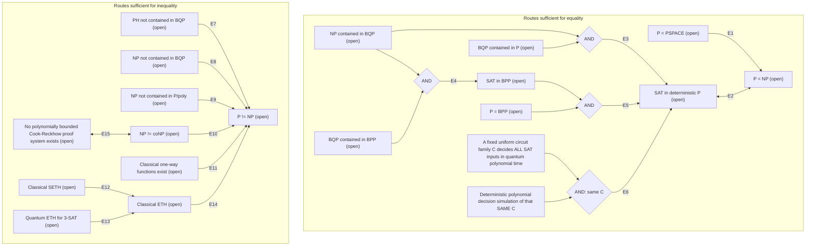

# A selective implication map toward P versus NP

S3051 / E014 / E004, 2026-09-11. Under INTEGRITY-CLAIMS.md. **Studying an intermediate problem can be a good strategy when its exact implication and missing hypotheses are explicit. A short arrow to P versus NP does not make its starting problem easier.** This map collects selected established implications between propositions; it is not a map of all possible future proof methods. No finite catalog can enumerate unknown future techniques.

An arrow means the proposition at its source would logically imply the proposition at its destination. It does **not** mean one complexity class is contained in another unless that containment is written inside the node. All major equality/separation assertions displayed are unresolved; the arrows/equivalences are established mathematics. The diamonds are conjunctions: both incoming hypotheses are required. Counterfactual branches toward equality and inequality are alternatives, not assertions that both conclusions hold.

The circuit-family row is a conditional bridge, not a claim that such a SAT-deciding family or simulator has been found. C may be a narrower family than all BQP circuits. E6 does not require full-state simulation or exact amplitudes. Conversely, BQP contained in P is only a decision-class statement: it does not promise efficient exact amplitude evaluation for arbitrary circuits.

## Edge ledger: why each arrow holds

Sources are the previously reviewed primary references, linked directly below. Logical compositions and contrapositives are identified as such, rather than attributed as new research results. The [classical catalog](2026-09-11-complexity-open-questions-classical.md) and [quantum catalog](2026-09-11-complexity-open-questions-quantum.md) retain the detailed model/status qualifications and recent-work checks.

| Edge | Exact justification | Primary anchor / scope |
|---|---|---|
| E1 | P contained in NP contained in PSPACE; P=PSPACE collapses the intermediate NP class to P. | Logical composition of standard containments; [Cook official P/NP statement](https://www.claymath.org/wp-content/uploads/2022/02/MPPc.pdf). [Williams2025](https://eccc.weizmann.ac.il/report/2025/017/) is a quantitative time/space advance, not a proof of this equality. |
| E2 | SAT is NP-complete under deterministic polynomial reductions and belongs to NP. Thus SAT in P iff P=NP. | [Cook](https://www.claymath.org/wp-content/uploads/2022/02/MPPc.pdf). Runtime includes reading/constructing the encoded instance. |
| E3 | NP contained in BQP and BQP contained in P imply NP contained in P. | Logical transitivity; definitions and P contained in BQP from [Watrous](https://arxiv.org/abs/0804.3401). Both hypotheses are unresolved. |
| E4 | NP contained in BQP and BQP contained in BPP imply SAT in BPP. | Same decision-class composition. A uniform polynomial weak sampler with sufficiently small total-variation error for arbitrary BQP output distributions is a sufficient route to the second hypothesis; average-over-circuits accuracy is not. [Watrous](https://arxiv.org/abs/0804.3401). |
| E5 | SAT in BPP plus P=BPP implies SAT in P. | Definitions; [Impagliazzo-Wigderson primary author bibliography](https://cseweb.ucsd.edu/~russell/) lists the hardness-based derandomization theorem, whose hardness hypothesis must not be assumed proved here. |
| E6 | One uniform general-SAT quantum decider plus a deterministic polynomial decision simulation for that very family supplies a deterministic SAT algorithm. | Direct composition, not a new simulation theorem. The precise acceptance-error contract is below; quantum uniformity/decision conventions from [Watrous](https://arxiv.org/abs/0804.3401). |
| E7 | If P=NP then PH=P; since P contained in BQP, PH would be contained in BQP. Contrapositive gives the arrow. | Standard hierarchy-collapse consequence of SAT completeness; see [Cook](https://www.claymath.org/wp-content/uploads/2022/02/MPPc.pdf). The opposite-direction oracle result of [Raz-Tal](https://eccc.weizmann.ac.il/report/2018/107/) is not this unrelativized premise. |
| E8 | If P=NP then NP contained in BQP, because P contained in BQP. | Contrapositive; [Watrous](https://arxiv.org/abs/0804.3401). A black-box query lower bound does not establish this premise for explicit SAT. |
| E9 | P contained in P/poly. Thus an NP language without polynomial-size circuits cannot belong to P. | Uniform versus nonuniform distinction; [Williams's circuit paper](https://people.csail.mit.edu/rrw/acc-lbs.pdf). Its NEXP versus ACC theorem is already known and is not the NP versus P/poly premise. |
| E10 | P is closed under complement; P=NP would force NP=coNP. | Contrapositive; [Cook-Reckhow](https://www.cs.toronto.edu/~sacook/homepage/cook_reckhow.pdf) and [Cook's explicit correction](https://www.cs.toronto.edu/~sacook/). |
| E11 | If P=NP, the NP search relation for n-bit preimages of a polynomial-time function (with the input length n supplied in unary) is solvable in polynomial time by bitwise search, so that function cannot be one-way. | Standard search-to-decision argument. Classical OWFs require average-case hardness against probabilistic polynomial-time inversion; [Liu-Pass](https://eccc.weizmann.ac.il/report/2021/059/) gives exact related characterizations, not an unconditional OWF construction. |
| E12 | Standard deterministic SETH implies ETH; failure of ETH transfers subexponential solvability to every fixed k using sparsification and the appropriate size-preserving reductions. | [Impagliazzo-Paturi-Zane](https://www.ccs.neu.edu/home/viola/classes/papers/ImpagliazzoPaturiZane01Which.pdf). Do not confuse arbitrary polynomial reductions with subexponential-preserving ones. |
| E13 | A deterministic subexponential 3-SAT algorithm would also be a bounded-error quantum subexponential algorithm. | Containment of classical computation in the quantum model. Quantum ETH here is explicitly no bounded-error 2^o(n) poly(input-length) quantum algorithm for 3-SAT, not a different QSETH compression framework. [Quantum fine-grained primary context](https://arxiv.org/abs/1911.01973). |
| E14 | A polynomial-time algorithm for 3-SAT would contradict ETH. | 3-SAT completeness and the deterministic ETH convention; [Impagliazzo-Paturi-Zane](https://www.ccs.neu.edu/home/viola/classes/papers/ImpagliazzoPaturiZane01Which.pdf). Randomized hypotheses require separate labels. |
| E15 | Some polynomially bounded Cook-Reckhow proof system exists iff NP=coNP; negate both sides. | [Cook-Reckhow](https://www.cs.toronto.edu/~sacook/homepage/cook_reckhow.pdf), with [author correction](https://www.cs.toronto.edu/~sacook/). Quantification over **all** systems is essential; a fixed Frege/EF lower bound is insufficient by itself. |

ETH means no deterministic 2^o(n) poly(input length)-time algorithm for 3-SAT on n variables. SETH means that for each epsilon>0 some fixed k has no O((2-epsilon)^n poly(input length)) deterministic k-SAT algorithm. They are stronger hypotheses than P!=NP, not consequences known to follow from it. Quantum ETH implies the classical hypothesis, but its truth remains open. These are hypotheses about families of increasing input sizes, not finite benchmarks.

## The same-family simulation bridge in operational terms

Fix a uniform polynomial-time generator that, from any CNF bit string F, constructs a polynomial-size quantum decision circuit C_F. Its acceptance probability must be at least2/3 on every satisfiable F and at most1/3 on every unsatisfiable F. Preparation, ancillas, gates, classical control and synthesis precision all need polynomial resources in the bit length of F. A promise confined to easy formulas or SAT-only witness search does not meet this premise.

It suffices to have a deterministic polynomial-time algorithm that approximates the acceptance probability of every such C_F to additive error at most1/12: thresholding at1/2 decides SAT. The gap and error budget make the implication explicit; an error merely smaller than the full 1/3 gap is not enough. The simulator need only estimate the designated decision probability, not print an exponentially large state vector. Exact simulation is unnecessarily strong.

If the corresponding estimator meets its stated error bound with probability at least2/3 over classical randomness on every input, its direct output is a BPP SAT algorithm; the P=BPP bridge is still needed to infer deterministic P. A weak sampler must approximate the relevant output distribution sufficiently well for bounded-error decision, with uniform guarantees for every input. State preparation from inaccessible amplitudes, exponential preprocessing/advice, an exponentially large decomposition, or precision represented as a free real number breaks the claimed polynomial resource bound.

Efficient simulation of Clifford circuits, low-width circuits or certain noisy circuits alone supplies only the second half for those families. One must also show that the **same** restricted family uniformly decides general SAT with a constant gap. If instead it solves only a tractable restricted SAT family, no general class collapse follows. Entanglement, teleportation and a height picture are not replacements for either premise.

## Important propositions with no known direct P/NP bridge

Missing arrows below mean the stated implication is not established; they are not proofs that future implications are impossible.

| Proposition or achievement | What is missing / established boundary |
|---|---|
| P=BQP by itself | Equivalent to BQP contained in P, since P contained in BQP; still needs NP contained in BQP to use E3. |
| P!=BQP by itself | No known direct implication deciding P versus NP. Quantum advantage need not be NP-complete problem advantage. |
| BQP not contained in PH | No known direct P/NP implication. Do not reverse it into PH not contained in BQP, which is E7. [Raz-Tal](https://eccc.weizmann.ac.il/report/2018/107/) proves a relativized separation, not either unrelativized resolution. |
| L=NL or L!=NL | Both classes lie inside P. Their relationship does not currently decide P versus NP. [Reingold's undirected result](https://omereingold.wordpress.com/wp-content/uploads/2014/10/sl.pdf) is established; directed reachability is the open general problem. |
| VP=VNP or VP!=VNP | Algebraic class question over specified fields/constants; neither is an unconditional synonym for Boolean P versus NP. Uniformity, arithmetic operations and bit-cost transfers cannot be skipped. |
| General integer-circuit PIT is in deterministic P | [Kabanets-Impagliazzo](https://www.cs.sfu.ca/~kabanets/Research/poly.html) imply **NEXP not contained in P/poly OR permanent lacks polynomial-size arithmetic circuits**. This is a disjunction, not either separate conclusion and not a direct P!=NP theorem. |
| Superpolynomial lower bounds for one fixed Frege/EF system | Important open targets, but E15 needs the universal absence of short-proof systems. Further conditional bridges must retain their extra hypotheses. [Pich-Santhanam](https://arxiv.org/abs/2312.08163). |
| NEXP not contained in ACC; PRIMES in P; quasipolynomial GI | Established results with precise scopes, not fresh open targets or P/NP resolutions; primary links are in the classical catalog. |
| Better QAOA overlap or a lower-bound example for one representation | Requires total algorithm/resource and general-input guarantees before any class consequence. Lower bounds for a restricted representation do not exclude other algorithms. |

Relativization, natural proofs and algebrization are established methodological limitations with their own precise hypotheses, not three more unresolved class assertions. The catalog's primary-source barrier section explains their conditional/model-dependent scopes. Labeling a technique geometric or quantum does not show that it escapes a barrier.

## Strategic choice and one next gate

The graph supports choosing a sharply specified intermediate problem for its testable content and relevance, not for its visual distance from P=NP or P!=NP. NP versus P/poly and NP versus coNP would be powerful separation routes, but they are themselves major unresolved problems. This map supplies no ordinal difficulty ranking, success probability or claim that an intermediate step is easier.

**Optional recommended gate: test the scope of a decision-relevant restricted-simulation claim (catalog Q8), before starting a proof or experiment.** Fix the intended family to fixed-angle, correlated-parameter bounded-degree QAOA circuits with explicitly specified local noise, and the observable to the global projector onto satisfying assignments of the input formula. The gate question is whether a named published Pauli-truncation/noisy-simulation guarantee already gives a uniform additive1/12 estimate for that observable with polynomial total construction cost, or only a local-observable/parameter-averaged guarantee.

The additive1/12 target is only an illustrative simulation-accuracy specification for this gate. Current QAOA satisfying probabilities can be exponentially small: the constant-zero estimator can then meet that error tolerance while revealing no SAT information. Before calling a result decision-relevant, specify the intended probability range and a nonvacuity criterion, such as a promised acceptance/rejection gap large enough compared with total approximation error. Do not transfer the hypothetical constant-gap decider premise into the current QAOA family.

For this gate, first choose one exact published theorem and record its circuit depth, noise, geometry, observable-support and parameter-distribution hypotheses; compare every one against the intended family and output. The [Q8 source record](2026-09-11-complexity-open-questions-quantum.md) gives the nearest sources and already flags correlated-angle and global-observable distinctions. GO only if a concrete missing lemma or explicit counterexample target can be stated beyond an existing corollary. STOP if the desired guarantee is already implied, needs exponential support enumeration, or changes the target output to local energy. No simulator is being implemented here.

This would be a bounded classification/novelty gate, not a claim to solve the SAT-in-BQP premise. The current QAOA circuits have no uniform all-input SAT decision guarantee. A restricted simulation result could be useful on its own while having no immediate P/NP consequence. Keeping those two obligations separate prevents another broad reformulation from becoming a disguised assumption of the conclusion.

## Prior outcomes constrain this choice

- The Horn/Hodge/holographic audits rejected or held particular effective-representation contracts; they did not exhaust every classical or geometric technique. Reuse their precise obstruction statements; do not rerun the same examples under a new label.
- [S3048](2026-09-11-qaoa-logical-cost-report.md) is complete: STOP that frozen construction as a unitary-gate advantage candidate on the seven tested instances. Classical verification remains a separate resource; no total-runtime impossibility was proved.
- [S3050](2026-09-11-qaoa-contribution-assessment.md) recommends HOLD for the combined tails/resource publication. The finite2.6923 averaging penalty remains valid, but the source already discusses tails and no distinct combined paper contribution is established. No new batch, synthesis campaign or manuscript is activated by this map.

The recommended gate is a new choice for review, not execution authorization. All direct implications above remain conditional on their unresolved premises. No local P=NP/P!=NP result, new proof or quantum experiment is reported.

[Independent implication-map review](2026-09-11-complexity-implication-map-review.md).

## Dated gate outcome: S3052, 2026-09-11

The optional scope gate above has now completed: **STOP this transfer**, with no new proof or simulator target recommended. The [reviewed assessment](2026-09-11-restricted-simulation-bridge-assessment.md) accepts the published noisy-simulation theorem but finds no guarantee for prescribed correlated angles or the missing SAT decision signal. Global Pauli observables are allowed; observable support alone is not the obstruction. The earlier proposal remains historical context, and no successor is activated.
