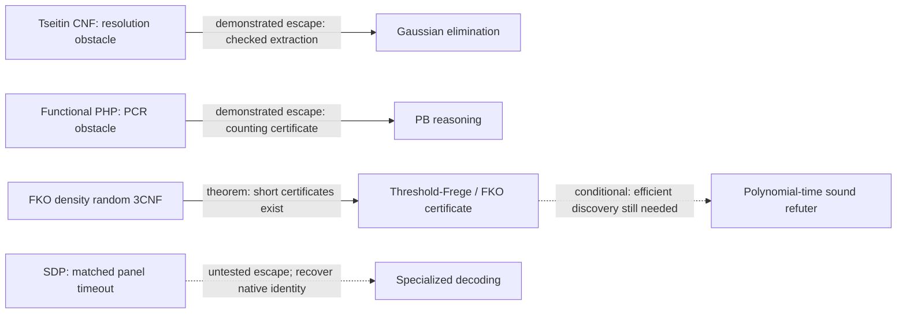

# The shapes of SAT methods: representations, operations, and limits

2026-09-11; S3062. A source-backed method atlas, not a new algorithm or theorem. Read the [integrity boundary](../../INTEGRITY-CLAIMS.md) and the [S3061 frontier report](2026-09-11-solver-frontier.md). This atlas asks what each method can express economically, what it actually computes, and what an escape must pay for. It does not identify a universal obstruction or select a new implementation project.

**The shared issue is not simply lost information.** Several methods represent the original problem exactly; their difficulty is the size of a useful intermediate representation or the work needed to discover it. Bounded relaxations really can admit spurious possibilities. These are different mechanisms and need different witnesses.

**Compact input is not a tractable-query guarantee.** Ordinary CNF already stores an arbitrary SAT instance compactly. A useful representation must also support the required query at a charged cost, and must be obtainable from the input without hiding the difficult search. Verifying one candidate assignment is easy; deciding whether any assignment exists is a different query.

Evidence labels: **[T]** established theorem or exact semantic fact; **[E]** finite empirical evidence under named conditions; **[O]** open or unestablished claim; **[A]** explanatory analogy, not a lower bound. An escape below is an escape for the named family/model, not a universal ranking of methods.

## Reading the representations correctly

| Kind of transformation | What is preserved | What can change |
|---|---|---|
| Add a sound consequence while retaining premises | Exactly the same satisfying assignments on the original variables | Formula/proof size, propagation strength and search cost |
| Introduce fresh variables with complete acyclic definitions | Original assignments extend uniquely; projection recovers the original models | Variable count, encoding size and available proof shortcuts |
| Eliminate variables exactly | The existential projection, with a reconstruction obligation for witnesses | Individual eliminated assignments and counting multiplicities unless retained |
| Replace constraints by a necessary relaxation | Every true solution remains represented | Spurious fractional, affine or pseudo-moment states can appear |
| Exact compilation or decomposition | The represented Boolean relation, subject to its explicit output convention | Intermediate size and cost of discovering the order/decomposition |

For example, a resolvent follows from two clauses, but replacing those two clauses by just their resolvent generally weakens the formula. Resolution proof search normally **adds** derived clauses; it does not thereby discard the original constraints. Likewise, Gaussian elimination preserves an affine system exactly, whereas replacing a nonlinear relation by its affine hull is a relaxation. A degree bound on a proof search is not automatically a claim that the input was discarded.

## What query is actually supported?

| Method | Efficient operation or verification contract | What does not follow |
|---|---|---|
| Clauses / CDCL | Check an assignment or one resolution inference in polynomial time; unit-propagate a finite clause database | Polynomial-time unrestricted SAT or short-refutation discovery |
| Pure affine equations | Decide consistency and produce a parametrization/witness by Gaussian elimination | Decide an arbitrary nonlinear residual inside that affine space |
| PB / CP | Verify a supplied arithmetic derivation with charged coefficient bits | Efficiently find useful cuts, an integer feasible point, or a short refutation |
| PC | Verify explicit polynomial steps; degree-d search has a degree-parameter cost | Polynomial work when degree or monomial count grows |
| SOS | Solve the specified bounded-degree relaxation under its numerical/bit assumptions | A genuine global distribution, SAT witness or exact certificate from an arbitrary numerical output |
| Frege / EF | Check a supplied proof and its definitions in polynomial time in proof length | Polynomial proof length or an efficient discovery procedure |
| Compiled / decomposed forms | Answer their named queries in compiled size / exponential width parameter | Efficient construction or small intermediate representations for every CNF |

## Proof and inference method cards

### 1. Resolution and clausal CDCL: clauses and a derivation graph

**Representation and operations.** A clause describes a forbidden partial assignment. Resolution combines `(x OR C)` and `(not x OR D)` into `(C OR D)`. CDCL maintains an assignment trail, propagates units, analyzes conflicts, learns clauses and changes search decisions/restarts. In the resolution-only model, the refutation is a graph of clause inferences.

**Preserved information.** Sound clause addition preserves the original model set. Clause deletion may remove useful search memory but does not itself justify deleting arbitrary original constraints. Preprocessing and extension rules require their own semantic and proof-complexity accounting.

**Success and witness.** **[T]** Resolution is complete, but expander Tseitin CNFs can require exponentially many resolution steps. The width-size relation explains this: necessary wide clauses imply long proofs. **[T]** Gaussian elimination solves the underlying pure parity system in polynomial bit time when its equations are available; recognition/translation from a given CNF must be counted. **[E]** current XNF solvers show a practical escape on selected CNF Tseitin tests. **[O]** a good branching heuristic is not a way around a resolution-size theorem; a stronger representation may be. [Width-size theorem](https://people.inf.ethz.ch/emo/SatSem05/Papers/BensassonWidgerson01.pdf), [Beame-Sun SAT 2026](https://drops.dagstuhl.de/entities/document/10.4230/LIPIcs.SAT.2026.5).

### 2. Parity reasoning: an affine space, or clauses over affine forms

**Representation and operations.** For `Ax=b` over GF(2), rows describe parity equations. Row addition, elimination and affine parametrization preserve the solution set exactly. CNF plus XOR and XNF are distinct: an XNF clause may be a disjunction of several affine equations, requiring nonlinear choice even though each constituent equation is linear.

**Preserved information.** Pure elimination loses no affine correlation. Extracting necessary affine consequences of CNF does not make them equivalent to the CNF: retain the residual constraints. An explicit parity system and its exponentially expanded clause truth table are not interchangeable input sizes.

**Success and witness.** **[T]** contradictory pure parity is a polynomial-time success case. **[T]** positive one-in-three constraints illustrate the residual: odd parity allows both weight one and weight three; the latter is forbidden by exactly-one. Counting/inequalities can express that difference, but combining arbitrary affine and nonlinear constraints is not thereby easy. **[T]** Beame-Sun simulate Res(XOR) with nondeterministic choices and restarts; **[O]** this supplies no general efficient deterministic proof finder. Costs include recognition, basis changes, coefficient/row storage and residual search. [Current parity representation and simulation](https://drops.dagstuhl.de/entities/document/10.4230/LIPIcs.SAT.2026.5).

### 3. Pseudo-Boolean reasoning and Cutting Planes: integer halfspaces

**Representation and operations.** Boolean variables satisfy integer linear inequalities. CP combines valid inequalities with nonnegative multipliers and uses an integer rounding/division rule. Branching on an inequality is a further operation, modeled by systems such as Stabbing Planes. Extension variables are additional proof resources, not free notation.

**Preserved information.** Sound integer cuts preserve Boolean feasible points. The continuous LP relaxation can admit fractional points that are not assignments; this is genuine relaxation slack. A fractional feasible point only blocks that relaxation, not all future cuts.

**Success and witness.** **[T]** pigeonhole is exposed by summing occupancy/capacity inequalities; discovering a useful cardinality encoding is a separate cost. **[T]** CP has quasipolynomial-size refutations of the specified CNF encodings of inconsistent prime-field linear systems. **[T]** random logarithmic-width k-SAT has CP size lower bounds; this does not state a random-3SAT bound. **[O]** unrestricted-SP size lower bounds and stronger proof-search questions must not be replaced by low-weight results. Charge coefficient bit length, separation/cut selection, proof depth and total size separately. [CP/SP exact scopes, Theorems 1.3-1.5](https://www.theoryofcomputing.org/articles/v022a002/v022a002.pdf), [random-kSAT CP bounds](https://eccc.weizmann.ac.il/report/2017/045/). PB certification of parity using extensions is already established. [Gocht-Nordstrom, Section 4](https://ojs.aaai.org/index.php/AAAI/article/download/16494/16301).

### 4. Polynomial Calculus: polynomial consequences in a fixed field

**Representation and operations.** Translate clauses to polynomial equations with Boolean axioms; derive linear combinations and multiply previous equations by variables. A refutation derives the constant polynomial 1 as zero. PC/PCR resource measures include degree and the number of written monomials, as well as coefficient representation.

**Preserved information.** The standard Boolean encoding is exact on Boolean points, and sound deductions preserve its solutions. Bounded-degree search restricts available derivations; it does not erase the high-degree logical consequences from the original problem. Changing characteristic, Boolean basis, or permitting circuit/extension representations can change proof complexity.

**Success and witness.** **[T]** linear GF(2) equations are tractable over the matching field. **[T]** functional-PHP gives degree/size obstructions in the specified PC/PCR setting, despite its counting escape. **[O]** an expensive monomial representation is not a lower bound for every succinct algebraic circuit representation. Even recent extension-PC bounds for the Binary Value Principle do not transfer to ordinary CNF Frege/EF bounds. [PC definitions, Section 8](https://jakobnordstrom.se/docs/publications/AutomatingAlgebraic_STOC.pdf), [functional-PHP bounds](https://arxiv.org/abs/1505.01358), [extension-PC warning](https://www.theoryofcomputing.org/articles/v022a004/v022a004.pdf).

### 5. Sum of Squares: polynomial positivity and truncated moments

**Representation and operations.** SOS uses polynomial identities and nonnegative sums of squares to certify infeasibility or bounds. A degree-limited dual represents selected moments with positivity and constraint-consistency conditions. This is not a list of candidate Boolean assignments.

**Preserved information.** A genuine solution distribution yields feasible moments. A low-degree pseudoexpectation need not extend to any global solution distribution: this is a precise example of a relaxation retaining locally consistent but globally unrealizable data. The underlying Boolean constraint encoding itself need not be lossy.

**Success and witness.** **[T]** random CSPs admit quantified density/degree upper and lower bounds. For the stated random-3SAT regime at m of order n^(7/5), the SOS obstruction still requires growing degree, while short threshold-Frege certificates exist. Higher degree is an escape with a rapidly increasing search space, not a free repair. SDP matrix dimension, bit precision and certifiable feasibility matter; `n^{O(d)}` is a degree-parameter cost, not a general polynomial bound. **[O]** these results do not exclude every non-SOS algorithm or extension. [Pseudoexpectations and random-CSP tradeoffs, Sections 2.3 and 7](https://www.cs.cmu.edu/~odonnell/papers/csp-sos-lower-bounds.pdf), [threshold-Frege upper bound](https://arxiv.org/abs/1101.3970).

### 6. Frege and Extended Frege: formulas with reusable definitions

**Representation and operations.** Frege permits unrestricted propositional formulas and a fixed sound complete rule basis. EF additionally names previously constructed formulas with fresh defined variables, allowing circuit-like sharing. It can express deductions that are cumbersome as clauses or expanded monomials.

**Preserved information.** A complete definitional extension preserves the original assignments under projection and gives each a unique extension. It is not an approximation or permission to assume a desired lemma. Finding helpful definitions and their proofs remains work.

**Success and witness.** **[T]** random 3CNFs in the sufficiently dense n^(7/5) regime have polynomial-size TC0-Frege refutations. **[O]** general superpolynomial Frege/EF size bounds remain open; so does an unrestricted efficient proof finder. Absence of a lower bound is not a success guarantee. Count every definition, formula/circuit size, proof step and its search. A lower bound for one system would not by itself rule out every polynomially bounded proof system. [Definition and extension soundness, Cook-Reckhow Section 4](https://www.cs.toronto.edu/~sacook/homepage/cook_reckhow.pdf), [concrete short proofs](https://arxiv.org/abs/1101.3970), [current EF boundary](https://arxiv.org/abs/2312.08163).

## Shared residual gaps: theorem versus interpretation

1. **[T] Several proof systems share an exact discovery obstruction.** De Rezende et al. construct the same formulas with a simultaneous size gap for resolution, Nullstellensatz, PC and Sherali-Adams, yielding NP-hardness of shortest-proof-relative automation. SOS, CP and EF are not automatically included in that theorem. This is a real shared result, not a universal explanation of industrial timeouts. [Theorem 1.1](https://jakobnordstrom.se/docs/publications/AutomatingAlgebraic_STOC.pdf).
2. **[O] Useful global certificate discovery remains a concrete gap.** At the FKO random-3SAT density, short certificates and short threshold-Frege proofs exist, but a general polynomial-time finder is not established in the checked literature. The missing bounded-overlap tuple discovery is specified in the [S3061 theory note](2026-09-11-solver-frontier-theory.md). It remains an illustration, not an automatically chosen research project.
3. **[A] 'Compact local descriptions need expensive global coordination' is a useful comparison, not a proved universal obstruction.** It describes different facts in different models: many separator states, high-degree moments, long restricted proofs, or difficult proof search. These resources are not equivalent. Large treewidth does not imply a CP lower bound; an SOS pseudoexpectation does not imply a hard quantum search tree; a clausal timeout does not imply absence of short EF proofs.
4. **[E] The SAT 2026 failure intersection is an implementation fact.** Forty-three identical inputs have no SAT/UNSAT result across 33 submitted sequential configurations at the recorded budget. They are not known to defeat native decoding, every PB/XOR solver, every preprocessing, or quantum methods. The [public evidence](2026-09-11-solver-frontier-practice.md) is not a common structural theorem.

## Structural and search cards

The [structure companion](2026-09-11-method-shapes-structure.md) gives the definitions, theorem locations and costs for these additional shapes.

| Shape and operations | Preserved information and query | Explicit success, limit and escape |
|---|---|---|
| Separator DP: tables on boundary assignments; join and forget | Exact existential boundary relation. Feasibility queries use the table; counting/witness reconstruction require their appropriate stored data. | The star `AND_i(h OR x_i)` has width one. A poor cut can still expose many affine interface states; changing the joint decomposition can repair it. Width and decomposition discovery both cost. |
| OBDD / d-DNNF: branch and merge, or decomposable AND / deterministic OR | Exact Boolean function. Consistency/counting guarantees are polynomial in the relevant compiled representation, not source CNF. | Equality pairs require 2^r residuals in the all-X-before-all-Y OBDD order but O(r) nodes when interleaved. This is an order-specific size witness, not an equality-solving lower bound. |
| Tensor contraction: multiply local tensors and sum shared indices | Exact dependence on open indices until approximation is explicitly introduced. The selected output probability/count is a separate query specification. | Bounded-width chains have cheap contractions; dense intermediates can cost exponentially. Algebraic structure or another order can escape. Markov-Shi assumes constant gate arity, an initially unentangled computational-basis input and local final measurements/traces. Include any other state-preparation network, global verifier/projector and precision before invoking its width bound. |
| Symmetry reduction: verify automorphisms and impose safe orbit restrictions | Preserves SAT existence, generally removes models. Raw counts are not preserved without orbit accounting. | Interchangeable colors can create redundant branches. Detecting symmetry, choosing compatible restrictions and checking them cost; no complete cheap orbit transversal is assumed. |

For incidence-width counting, the older fully parameterized Samer-Szeider bound in the companion is not the current best exponent: [Slivovsky-Szeider, SAT 2020](https://www.ac.tuwien.ac.at/files/tr/ac-tr-20-006.pdf) improves the dependence from 4^t to 2^t with polynomial factors. The supplied/found decomposition and bit-arithmetic conditions still matter.

**Witness search / quantum search.** Local search represents one or more candidate assignments and scores; a verified satisfying assignment is decisive, while failed search is not an UNSAT proof. Quantum search represents amplitudes and applies reversible transformations before sampling. Measurement yields limited classical output; that fact alone is not a proof-complexity lower bound. Backtracking speedups concern a specified tree and reversible predicates. QAOA/local-energy performance is not automatically global SAT success. In the published affine-restricted one-in-three example, classical and quantum methods share the reduction; the untested issue is the residual solver and full costs, not whether the preprocessing exists. Exact primary scopes are in the [quantum/alternative assessment](2026-09-11-solver-frontier-alternatives.md) and [example 5](2026-09-11-method-shapes-examples.md).

## Same-object witness and escape map

The [six-example companion](2026-09-11-method-shapes-examples.md) fixes each encoding, distribution or artifact identity. Its distinctions prevent assembling unrelated limits into an invented universal barrier.

| Same object | Limitation | Escape and its price | Residual status |
|---|---|---|---|
| Bounded-degree odd-charge expander Tseitin CNF | [T] Long resolution proofs | Checked constant-arity XOR recovery and Gaussian elimination: polynomial work on this encoding | No general hardness remains for this pure-affine family |
| Standard functional PHP, without onto clauses | [T] PCR monomial-size bound | Recognize AMO structure and give a justified counting proof | Different proof language; not a contradiction of PCR bounds |
| Random 3CNF, m=ceil(C*n^(7/5)) | [T] Restricted-model bounds | [T] Short FKO/threshold-Frege certificates exist; [O] polynomial finder missing | A supported discovery gap, not universal short-proof hardness |
| Exact SDP competition GBD identity | [E] All 33 submitted sequential configurations time out | [O] Native ISD/PB/XOR/quantum comparison requires original-instance reconstruction | Provenance/comparator gap; not a known all-methods obstruction |
| Positive one-in-three relation | [T] Odd-parity relaxation admits unwanted weight-three assignments | Retain nonlinear residual; charge both classical/quantum residual processing | [O] Comparative advantage, no general efficient solver supplied |
| Historical paired-path CNF/XOR input with fixed X/Y cut | [T] Specified ascending syndrome enumeration is exponential | Equality substitution and joint clause recognition give a polynomial repair | Known easy family; historical illustration, no new target |

Arrows concern the named object and condition; they are not containments or general strength rankings. The analogy of expensive global coordination is deliberately excluded from the theorem arrows. No new proof, solver run or inference demonstration was performed, and no new mechanism or experiment is selected by this atlas.
