# Research meta-graph: evidence, transformations and open transitions

2026-09-11; S3068 user-directed addition, updated through S3076. This is a persistent research ledger, not an executable quantum walk, a discovered holographic algorithm or a new complexity result. Nodes record a representation and its required query; edges record an established transformation, a restricted failure, or an unproved step. This small ledger is a different level from the exponentially large lifted-state graph inside the rooted-operator node. Double covers and quantum interference would act on that internal graph, not automatically on ledger arrows that may be lossy or noninvertible. The [novelty assessment](2026-09-11-fko-novelty.md) supplies the claim-level conclusion.

```mermaid
flowchart TD
  CNF[Explicit signed 3-CNF]
  GEOM[Distinct even-incidence tuple family]
  ODD[Odd tuples with verified clause loads]
  CERT[Sound FKO tuple certificate]
  ROOTCERT[Sound rooted spectral refutation]
  ONE[One verified odd tuple]
  BASIS[Known full random-order greedy basis]
  CIRCUITS[List containing all short odd circuits]
  ENUM[Known connected-subset enumeration baseline]
  HALFLIST[Half-size unions of logarithmically many connected pieces]
  PRICE[Exact minimum-price short odd tuple oracle]
  PACK[Exact feasible approximate short-tuple packing]
  INDEX[Polynomial-gate padded half-index decoder]
  CLAW[Dyadic colored threshold claw]
  QQUERY[Bounded-error quantum price query]
  QRAG[Fast search with addressed quantum-memory gates]
  GATE[Historical direct-scan gate bound]
  ORDINARY[Explicit ordinary-gate weighted claw search]
  LOCAL[Capped maximum-overlap growth]
  ROOT[Rooted Kikuchi operator and defect data]
  WALK[Labeled signed killed walk]
  FREE[Labeled degree-normalized non-killed walk]
  START[Classical stationary start on good random inputs]
  ELIG[Necessary root-balanced parity eligibility]
  EXAMPLE[Finite nonempty retained label cycle]
  KILL[Suppressed killed-history output on good random inputs]
  DIRECT[Direct identity or Walsh planar-matchgate route]
  MOM[Normalized even trace moment]
  UPPER[Certified global spectral upper bound]
  DOUBLE[State plus sign-parity bit]
  TENSOR[Compatible tensor basis and tractable contraction]
  QUANT[Costed coherent walk and useful output]
  CNF -. U1: geometric discovery .-> GEOM
  GEOM -->|V1: sign filter| ODD
  ODD -->|V2: verify inequality| CERT
  CNF -->|V13: known basis processing| BASIS
  BASIS -->|V14: bounded-degree repetition bound| CIRCUITS
  CNF -->|V15: matching deterministic baseline| ENUM
  ENUM -->|V16: parity and sign checks| CIRCUITS
  CIRCUITS -. U6: historical packing gap closed by V19 .-> ODD
  CNF -->|V17: charged universal half-list| HALFLIST
  CNF -->|V21: reversible forest decoder| INDEX
  INDEX -->|V22: polynomial price-bit expansion| CLAW
  CLAW -->|V23: bounded-error query search| QQUERY
  CLAW -->|V24: explicit QRAG model| QRAG
  QQUERY -->|V25: amplified calls and exact checks| PACK
  QRAG -. U7: historical scan limitation .-> GATE
  CLAW -->|V26: dummy buckets plus heavy-pair search| ORDINARY
  ORDINARY -->|V27: amplified pricing and exact checks| PACK
  HALFLIST -->|V18: exact rational price query| PRICE
  PRICE -->|V19: polynomial-call rational packing| PACK
  PACK -->|V20: exact loads and robust-margin verification| ODD
  CNF -->|V3: declared policy| LOCAL
  LOCAL -. F1: restricted failure .-> GEOM
  CNF -->|V4: rooted construction| ROOT
  ROOT -->|V5: row queries| WALK
  WALK -->|F2: sampler-specific bound| KILL
  ROOT -->|V9: change normalization| FREE
  ROOT -->|V11: rejection preparation| START
  START -->|V12: classical walk start| FREE
  FREE -->|N1: output invariant only| ELIG
  EXAMPLE -->|E1: finite feasibility only| ELIG
  FREE -->|V10: negative return only| ONE
  FREE -. U5: mass and coverage .-> ODD
  CNF -. F3: direct route fails prerequisites .-> DIRECT
  WALK -->|V6: expectation identity| MOM
  WALK -->|V7: negative return only| ONE
  ONE -. U4: yield and coverage .-> ODD
  MOM -. U2: accuracy and proof .-> UPPER
  UPPER -. U3: all defect terms .-> ROOTCERT
  WALK -->|V8: parity double cover| DOUBLE
  ROOT -. S1: tractable basis unknown .-> TENSOR
  DOUBLE -. S2: implement and extract .-> QUANT
```

ROOTCERT is the complete rooted spectral certificate, distinct from the FKO tuple certificate CERT. V7 ends at one odd tuple; the unproved U4 edge must supply sufficient yield and verified clause coverage before V2 applies.

| Edge | Evidence and exact scope | Cost or outstanding obligation |
|---|---|---|
| V1 | Conditional sign filtering for a sign-blind selected family; FKO already uses this architecture. [S3065](2026-09-11-adaptive-fko.md) | Distinct tuple IDs, sign access, load checks; the probability theorem does not discover the family. |
| V2 | Given tuples and a certified spectral bound, the strict FKO inequality is pointwise sound. [S3064](2026-09-11-fko-discovery.md) | Compute imbalance, loads and a directed numerical upper enclosure; reject if the inequality is not established. |
| V3/F1 | Exact capped, maximum-overlap, uniform-tie, sign-blind policy is defined; its fresh-restart failure at K=Theta(n^(1/5)) is restricted to that policy and random model. [S3066](2026-09-11-focused-growth.md) | Charges failed attempts; does not cover larger exploration followed by pruning or history-based priorities. |
| U1 | Historical geometric-discovery gap; S3073 supplies a charged subexponential pricing/packing route V17-V20. | Polynomial discovery and a worst-case P-versus-NP bridge remain unproved; this does not resolve walk-specific U4/U5. |
| V4 | Existing rooted operator construction accounts for every input clause. [Operator source](2026-09-11-global-fko-sources.md) | Implicit input is compact; dimension binom(n,ell), diagonal trace and defect sums remain charged. |
| V5/V6 | Channel-labeled killed walks have polynomial local queries; signed return expectation equals tr(H^(2p))/N. [S3067](2026-09-11-global-fko.md) | Number of walks, length, exact transition probabilities, precision and failures. An expectation identity is not an upper certificate. |
| V7 | A negative closed 2p-step rooted walk reduces to at most 4p original clause IDs with odd parity. [S3067](2026-09-11-global-fko.md) | Verify original labels; no lower bound on useful return frequency or packing coverage. |
| U4/U5 | One verified tuple is not yet a useful family. Neither non-killed normalization nor stationary preparation establishes aggregate weighted return mass. [S3070](2026-09-11-nonkilled-return.md) | Bound nonempty root-balanced, retained-realizable parity-return mass and capacity-controlled outputs. An inverse-polynomial mass targets polynomial sampling; a weaker quantified improvement over existing search is also meaningful. |
| V11/V12 | Uniform state/root rejection samples classical pi(S) proportional to retained degree. On the specified iid-input and uniform-root good event, expected proposals are O(n^(13/5)), each polynomial work. [S3070](2026-09-11-nonkilled-return.md) | Shared input exception is o(1); finite caps report no output. This proves classical access, not useful return mass or efficient coherent preparation. |
| N1 | Every closed-history selector q obeys Bq=0 and Rq=0. This is necessary eligibility, not a generator or sufficient retained realization. [Retained-cycle audit](2026-09-11-retained-cycle-audit.md) | A fixed degree-two e-clause cover survives independent random rooting with probability PM(dual)/3^e <=3^(-e/2). No aggregate scarcity or adaptive-cover bound follows. |
| E1 | The finite four-clause K4 dual example has two parallel retained channels with a nonempty label cycle. [S3070](2026-09-11-nonkilled-return.md) | Establishes feasibility only, not random-input frequency, short useful mass or coverage. Preserve channel labels rather than only aggregated matrix signs. |
| F2 | On the specified iid-support, independent uniform-root good event, killed-history output is at most exp(-Omega(n^(1/5) log log n/log n)) per trajectory. [Reviewed S3069](2026-09-11-interference-extraction.md) | Shared input exception is only o(1). Uniform over starts on that fixed operator; standard tagged-sampler amplification is scoped separately. Not an interference or quantum lower bound. |
| V9/V10 | Normalize by retained degree instead of G+d_*, retaining channel labels; a negative closed L-step return still gives one verified odd tuple of size at most 2L. [S3069](2026-09-11-interference-extraction.md) | Restart isolated rows; charge row queries and readout. This is a different operator, so H_ref trace and spectral bounds do not transfer. |
| F3 | The direct incidence-network identity/Walsh standard planar-matchgate attempt fails its signature/topology prerequisites. [Holographic companion](2026-09-11-holographic-extraction.md) | Does not exclude arbitrary bases, gadgets, other representations or specialized coefficient methods. Code-enumerator reformulation alone has no cheaper contraction. |
| U2/U3 | Statistical trace accuracy and complete pointwise refutation are different contracts. [S3067](2026-09-11-global-fko.md) | Dimension-dependent accuracy for the chosen moment route, independently sound upper proof, and every global defect term. |
| V8 | Familiar signed double cover records cumulative sign as a bit. | Twice as many graph states; does not itself accelerate finding an opposite-sheet return. |
| S1 | Holographic transformations can preserve tensor contractions under compatible changes of basis. | No simultaneously tractable transformed signatures/topology or cheap certified contraction has been shown for this operator. |
| S2 | A signed graph can define a coherent quantum evolution under an explicit implementation. | State preparation, oracle construction, normalization, evolution time, accuracy, measurement and usable certificate extraction are unproved here. |

## What holography or interference would add

A meta-graph can immediately make research more useful by retaining transformations, failed hypotheses, source links, costs and output guarantees. Adding an edge requires evidence; an earlier failed route is not silently restored by renaming its representation. Nodes in this ledger are different kinds of objects, so their adjacency is not automatically a unitary or Hamiltonian.

For the actual signed walk there is a more concrete, already known graph construction. Replace each state S by (S,0) and (S,1). A positive channel preserves the bit and a negative channel flips it. A negative closed walk in the original graph becomes a path from (S,0) to (S,1). For positive and negative adjacency parts A+ and A-, the lifted adjacency is A+ tensor I + A- tensor X. This is the standard signed double cover, not a new mechanism. [Brown et al., Section 5, equation 25](https://arxiv.org/pdf/1211.0505).

A sign-basis change separates the unsigned and signed sectors. It makes cancellation explicit; it does not prove that a useful negative path can be found or read out cheaply. A quantum walk would require an implementable normalized evolution and a success/output analysis. The current killed classical walk is not itself unitary, and a research-ledger edge is not a physical transition.

Here 'holographic' has a precise algorithmic meaning, distinct from physical holography. Valiant's Holant theorem preserves the appropriate global sum under compatible local basis descriptions, while matchgate constructions can make that sum a tractable weighted perfect-matching/Pfaffian computation in the required setting. Arbitrary tensor networks do not become easy simply by changing basis. All transformed local constraints must fit a tractable class together, with the required topology, and the basis and contraction must be obtained at charged cost. [Valiant, Theorem 4.1 and matchgrid definitions](https://people.seas.harvard.edu/~valiant/holographic11-07.pdf).

The useful open research question is therefore specific: can a representation change expose a simultaneously tractable global computation while preserving the needed all-input certificate or sufficiently detectable output? No such transformation or interference advantage has been established for these FKO instances. The graph records that obligation; it is not a proposal to run a new experiment or draft a paper.

## S3069 update and live boundary

The reviewed killed-sampler result diagnoses the chosen normalization, not intrinsic witness sparsity. The separate FREE node removes that normalization penalty while preserving original-clause witness verification. V10 still ends at ONE, and U5 remains unproved: return probability must exclude parity-empty backtracking, and enough useful outputs must survive clause-load checks. The extra edge to ODD is an unresolved combined yield-and-coverage obligation, not a demonstrated transformation.

The holographic companion checks a direct coefficient representation of short odd tuples. Its identity/Walsh and direct-planarity failures are F3 only; S1 remains speculative rather than refuted. Neither a changed basis nor the non-killed walk is recorded as an improved FKO finder. An improved random-input finder would still lack the worst-case bridge needed for P versus NP.

Evidence: [main derivation and three-lens table](2026-09-11-interference-extraction.md), [prior quantum output contract](2026-09-11-interference-prior-art.md), and [direct holographic assessment](2026-09-11-holographic-extraction.md). [Final independent claims-scope inspection](2026-09-11-interference-nonclaims-review.md) is GO for this ledger update; no executable graph, experiment or novelty conclusion is added.

## S3070 update: eligibility and classical access, not a finder

N1 is an invariant edge: it says what every output must satisfy, not that the walk efficiently produces such an output. Ordinary even-cover existence is insufficient to establish root balance or retained realization. The fixed-cover perfect-matching calculation cannot be applied to a root-adaptively selected family, nor can its exponential suppression be summed without accounting for all candidates. E1 explicitly rules out an all-cycles-cancel interpretation while making no distributional claim.

V11 closes a classical preparation-cost obligation on the declared random good event. It does not establish a quantum state-preparation advantage. U5 remains the substantive unresolved aggregate mass-and-coverage transition, and no new finder or novelty claim is recorded. No next sampler variant is selected. See the [main three-lens table](2026-09-11-nonkilled-return.md) and [global-alternatives comparison](2026-09-11-nonkilled-alternatives.md). [Final independent non-claims inspection](2026-09-11-nonkilled-nonclaims-review.md) is GO for this graph update.

## S3071 selection note: no additional verified edge

The [structured-code selection](2026-09-11-frontier-code-selection.md) and [aggregate-packing selection](2026-09-11-frontier-packing-selection.md), checked in the [independent selection review](2026-09-11-frontier-selection-review.md), select no supported new mechanism. Generic decoding exponents, implicit pricing, and short-cover existence have not supplied an applicable aggregate improvement. This is an evidence-limited selection outcome, not an all-method barrier or a claim that no such algorithm exists. U1, U4 and U5 remain open; no extra verified transformation is added.

The code note records one unselected proof question about a known full-matrix random-priority greedy-basis/fundamental-circuit heuristic. Its sparse pivot-survival and aggregate-load estimates are unproved here, and it is distinct in scope from the prior variable-restriction and capped local-growth bounds. Recording it does not select a campaign, confer novelty or count it as progress toward a finder.

## S3072 update: recovered circuits, matching known baseline

The [greedy-basis analysis](2026-09-11-greedy-basis.md) derives a bounded-degree sufficient-event probability and repeats known basis processing to recover every short circuit with stated high probability. V14 concerns that recovery contract only, at (O(Delta))^k times polynomial factors; it is not a polynomial finder. The [source comparison](2026-09-11-greedy-basis-sources.md) identifies an already available deterministic connected-subset algorithm with the same degree-based leading exponent (V15/V16). Thus these are analysis/baseline edges, not a new speedup. [Final independent claims-scope review](2026-09-11-greedy-basis-nonclaims-review.md) is GO for this update.

| New edge | Evidence and exact boundary |
|---|---|
| V13/V14 | Full random-priority Gaussian basis processing is known. On a fixed maximum-degree-Delta input, the sufficient isolation event recovers an e-clause circuit with probability at least [exp(-3/4)/(3Delta)]^e. Independent repetition and a union bound recover all circuits of size at most k. The random-input degree event is paid once. |
| V15/V16 | Minimal circuits are connected in the clause-intersection graph. Patel-Regts Lemma 2.4 lists all connected subsets up to k in O(M k^3 (exp(1) d)^k), d=max(1,3(Delta-1)); exact parity/sign filtering supplies the circuit-containing list. This matches the displayed degree exponent deterministically. |
| U6 | An odd tuple has an odd minimal component; replacing tuples by components preserves fractional mass without increasing clause loads. Computing a packing, numerical accuracy, strict spectral slack and exact certificate verification are separate obligations. No full end-to-end packing/refutation bit-runtime is established or pursued in this attempt. |

No novelty, strongest-baseline advantage, quantum speedup or achieved P-versus-NP stepping stone is recorded. The numerical-packing caveat is an explicit boundary, not an automatic new work item.

## S3073 update: reviewed deterministic pricing and packing

The [main derivation and three-lens table](2026-09-11-connected-half-pricing.md) adds an actual discovery mechanism, not merely an unproved arrow. Every short minimal weight-three circuit has balanced halves with O(log k) connected pieces. Enumerating all such possible halves, retaining exact incidence/sign/cardinality keys and recomputing price minima supplies an exact minimum-price oracle for all nonempty odd even-incidence supports of size at most k. Nonnegative rational prices and symmetric-difference verification are essential. The list need not enumerate every output tuple.

| Edge | Reviewed guarantee and charged conditions |
|---|---|
| V17 | Universal half coverage via the independently cross-checked cubic-pairing/tree partition. List preparation costs M^{O(log k)} 2^{O(k)} max(1,Delta)^{floor(k/2)} times polynomial original-input factors; no unknown witness tree or full-input decomposition is supplied free. |
| V18 | Exact minimum nonnegative rational price over all short odd tuples, or correct absence report. Syndrome/sign/cardinality bucket scans are linear in list length times polynomial factors, including bit costs; no quadratic list join. |
| V19 | Polynomially many adaptive price calls produce exactly feasible rational packing mass at least W_all/(1+epsilon). All original-clause loads, weight lengths and output sizes are charged, with polynomial inverse-epsilon dependence. This closes the former numerical-packing gap U6 through the new list route. |
| V20 | Source FKO robust witnesses give W_0>2H and W_0>=1. Epsilon=1/2 and a directed H enclosure of additive error at most 1/8 retain strict margin. Exact rational matrix bisection and certificate checks are polynomial bit work. Success is with high probability for sufficiently large fixed density constant and source-dependent k; verification is sound on every input. |

At M=Theta(n^(7/5)), Delta=O(n^(2/5)) and k=Theta(n^(1/5)), the upper logarithmic runtime is (1/5)k log n+O(k)+O((log n)^2), with constant epsilon. The same-cap full connected-set baseline has upper leading term (2/5)k log n. This comparison is checked only against that explicit baseline. The source's sampling model transfers to iid signed clauses through an O(M^2/n^3) collision exception; the degree event is charged separately. Exact support constants and other refuters' output contracts matter to broader comparisons.

[Source ancestry](2026-09-11-connected-half-sources.md) includes known cluster enumeration, signed syndrome joins and packing methods. No priority, literature-wide fastest result, quantum speedup, publication readiness or P-versus-NP conclusion is established. U4/U5 remain open for their actual walk samplers; V17-V20 do not bound those return distributions. The structural contributor's partition proof was checked by a different reviewer, and the pricing/wrapper received separate proof review. Final independent non-claims inspection of this updated ledger is GO in the [review record](2026-09-11-connected-half-nonclaims-review.md).

## S3074 update: indexed quantum queries and their memory model

The [reviewed quantum construction](2026-09-11-half-list-quantum.md) supplies an explicit padded forest-index decoder; no N-entry half list is supplied as quantum input. Its local evaluation is polynomial in the original input. That fact does not remove the much larger quantum walk working memory.

| Edge | Evidence and exact resource contract |
|---|---|
| V21 | Padded plane-forest/root/neighbor encodings cover the required halves with N=M^{O(log k)}2^{O(k)}D^{floor(k/2)} times polynomial factors. Invalid indices and duplicate descriptions count in N. Polynomial bounded decoding retains its index and uncomputes scratch; original-input table scans are charged. |
| V22 | Dyadic interval/prefix keys reduce summed nonnegative integer price thresholds to true cross-side equality with polynomial price-bit expansion. Same-side duplicates and invalid tags never count as claws. |
| V23 | Established quantum search gives N^{2/3} times polynomial factors in decoder queries. Threshold bisection and all adaptive packing rounds have an explicit amplified error budget. This is a query statement, not an ordinary circuit-time statement. |
| V24 | In the explicitly augmented quantum random-access-gate model, generic history-independent data structures give N^{2/3} times polynomial time and coherent-record memory. Setup, updates, extraction, seed lengths and fixed-time cutoffs are charged. The reviewed hybrid uses fixed-input seed tails and seed-independent ideal amplitudes, not a seed good for all subsets. |
| V25 | On the allocated search-success event, price calls meet the S3073 oracle contract and hence its packing bound. Every final tuple, load, mass and directed spectral inequality is checked exactly. Search failure can withhold a certificate but cannot justify a false refutation. |
| U7 | The direct ordinary-gate scan simulation has an N^{4/3} times polynomial upper bound at the chosen walk size. No improved ordinary-gate time is proved; this is not a lower bound against other implementations. |

At the FKO scaling, the query bound and separately the QRAG-model time bound have upper leading logarithmic term (2/15)k log n. This does not establish a physical quantum advantage, a fastest-known refuter or a P-versus-NP conclusion. Its gate-model boundary is substantive; polynomial access to one generated half is distinct from addressed access to exponentially many evolving quantum records.

The [novelty assessment](2026-09-11-half-list-novelty.md) retains unverified priority and strongest-algorithm status. Known cluster, syndrome-join and quantum-search ingredients are credited; no paper or implementation is selected by this ledger. Proof and complexity reviews cross-check contributor-owned reductions, and the generic data-structure repair is included. Final independent claims-scope inspection of this graph update is GO in the [non-claims review](2026-09-11-half-list-nonclaims-review.md).

## S3075 selection: real low-gate precedent, transfer unproved

The [ordinary-gate selection audit](2026-09-11-quantum-gate-selection.md) identifies Jaques-Schrottenloher's SAC 2020 golden-collision algorithm: a genuine approximately N^(6/7) ordinary-gate result, with substantial memory, in its random-function setting. This prevents interpreting U7 as an all-method impossibility. However, the inspected predecessor/marked-state argument has not been transferred to the exact duplicate-rich, weighted cross-side half decoder.

Output hashing preserves equal-key fibers. Canonical descriptions and unique invalid tags might remove encoding artifacts, but do not establish the required semantic multiplicities, retained optimal claw, random-iteration law or charged preparation. A random original formula is not automatically a random function on generated indices. The proposed transfer obligation is recorded in the audit, with no algorithm gain assumed.

U7 therefore remains open. No new verified transformation or theorem is added; the existing query/QRAG result is unchanged. [Independent source/scope review](2026-09-11-quantum-gate-review.md) is GO for this selection, the main note and this ledger update. No novelty, strongest-algorithm claim, implementation or goal completion follows from the selection.

## S3076 update: U7 discharged in the ordinary active-gate model

The [golden-transfer derivation](2026-09-11-golden-transfer.md) provides an explicit alternative to the old addressed-memory implementation. The previous U7 scan bound remains true for that implementation; its general access obligation is now discharged by V26-V27 in the stated theoretical model. Mathematical proof and complexity reviews are GO; [final independent non-claims inspection](2026-09-11-golden-transfer-nonclaims-review.md) is GO for this main/ledger update.

| Edge | Guarantee and conditions |
|---|---|
| V26 | On arbitrary fixed weighted colored keys, heavy useful fibers supply enough exact cross pairs for bounded pair search. For light useful fibers, pairwise key hashing and a deterministic dummy reservoir give a sufficiently small target bucket with constant seed probability and a density floor for every bucket. Fixed-point preparation, a product-tuple heat-bath walk, linear coordinate swaps and reversible sorting charge all ordinary gates. No random-function oracle, cheap QRAM, injectivity or independent-key premise is used. |
| V27 | Bounded-error threshold search costs N^(6/7) times polynomial factors in ordinary active gates, with N^(2/7) times polynomial quantum space. Polynomial adaptive pricing calls have a combined error budget and fresh explicit seeds. Exact original-clause, load, mass and spectral verification prevents false refutations even when search fails. |

At the same FKO support cap, the gate upper logarithmic leading term is (6/35)k log n and the quantum-space term is (2/35)k log n. The previously established robust-witness distributional application and its exceptions remain explicit; this is not a worst-case polynomial SAT algorithm. Active gates count idle memory as free: no physical, fault-tolerant or depth-width advantage is inferred.

SAC 2020 Section 3.5 already supplies the prefix architecture and N^(6/7) exponent. This increment derives a transfer for the indexed arbitrary-fiber query and charges its implementation; novelty and fastest status are unverified. The predecessor-based route itself is not proved, and this result does not provide the unresolved negative-return distributions of U4/U5. It introduces no publication, experiment or claim of completing the continuing goal.

## S3077 selection: park the quantum-method route

The [novelty audit](2026-09-11-gate-transfer-novelty.md), [application significance assessment](2026-09-11-gate-transfer-significance.md) and [independent source review](2026-09-11-gate-transfer-source-review.md) preserve V26-V27 as reviewed mathematical guarantees. SAC 2020 already supplies the exponent and prefix architecture; the inspected sources do not establish priority or fastest-known status for our transfer/application. The random-FKO application remains within the previously known exp(O(n^(1/5) log n)) broad runtime order. No established implication to P = NP or P != NP follows.

Selection: park further quantum-method refinement and repeated novelty searches pending a distinct supported mechanism. A uniform deterministic polynomial-time refutation finder complete for every unsatisfiable CNF would have a direct P = NP implication through a known polynomial timeout and sound verification. No mechanism meeting that target is identified here; it is a missing target, not a claimed stepping stone supplied by V26-V27. The worst-case bridge and research selection remain unresolved. This note adds no algorithmic edge, implementation or goal-achievement claim. Final combined source/significance inspection of this ledger addition is GO in the linked independent review.

## S3078 selection: direct implication, no supported mechanism

The [direct-magnification assessment](2026-09-11-direct-magnification-selection.md) verifies the existing OPS Theorem 1.4 implication: for its universal c, one epsilon>0 and every sufficiently small fixed beta>0, Gap-MCSP[2^(beta n)/(c n),2^(beta n)] outside general Circuit[N^(1+epsilon)], N=2^n, implies NP outside P/poly and hence P != NP. The archived Lean frontier map stores this kind of implication as data; it does not prove its antecedent.

One explicitly conditional proposal was tested: a promise-preserving coordinate embedding combined with syntactic gate shrinkage faster than the truth-table input shrinkage. The natural duplication embedding does not establish the necessary NO-promise amplification, because the source threshold M^beta is below the target N^beta. No supported replacement embedding or gate-shrinkage estimate emerged. Selection is NONE. This adds no verified lower-bound edge, new theorem or universal impossibility claim; all preceding verified edges remain unchanged. [Independent review](2026-09-11-direct-magnification-review.md) is GO for the bounded main assessment and this ledger addition; it does not certify the proposed lower-bound lemma.

## S3079: fixed-threshold feasibility, shrinkage still unproved

The [fixed-threshold derivation](2026-09-11-fixed-threshold-restriction.md) repairs the preceding promise mismatch: unsigned truth-table duplication preserves exact absolute circuit thresholds L,T over the declared B2 basis. Explicit circuit counting yields a stopping table length M of order T log(n+T)+L and a linear separator base bound. Proof and complexity reviews are GO for these facts and the conditional calculation; no shrinkage inequality is verified.

Proposed R concerns minimum-size separators only over the finite slab q0(n,beta)<q<=n generated by the original thresholds. If the specified gate simplification saved a factor 2^(1+epsilon) at every step, the reviewed consequence would have exponent 1+epsilon(1-beta), sufficient for the existing OPS implication with a smaller fixed exponent. This is a conditional proposal, not a new lower-bound edge. A perpetual fixed-T version would contradict a near-linear enumeration upper bound and is explicitly excluded.

The next bounded analytic test is an unproved charge on gates that coincide or simplify under the q coordinate identifications. No positive charge estimate, experiment or mechanism-success claim is selected by this ledger. Prior verified edges remain unchanged; the continuing goal is not achieved. [Final independent non-claims inspection](2026-09-11-fixed-threshold-nonclaims-review.md) is GO for this update.

## S3080: park the failed witness-to-diagonal charge

September 12, 2026 closeout metadata; September 11 filenames retain task continuity. The [gate-charge attempt](2026-09-11-separator-gate-charge.md) defines exact retained-record losses, including sharing and output-cone pruning. Minimum separator size supplies promised critical witnesses, but transporting them through cofactors does not preserve the exact NO threshold: the explicit multiplexer estimate only guarantees a hard cofactor from complexity greater than 2T+3, while the promise requires merely greater than T. Criticality preservation and semantic-to-syntactic record coincidence are also unproved.

Proof and complexity reviews are GO for this failed-argument assessment. No quantitative positive loss, shrinkage R or counterexample to R is established. Park this witness-to-diagonal approach; no further parameter/schema continuation is selected. Earlier verified facts and conditional implications remain unchanged, with no new lower-bound edge or goal-achievement claim. [Final independent non-claims inspection](2026-09-11-separator-gate-nonclaims-review.md) is GO for this main/ledger update.

## S3081: park the tested prefix-reconstruction construction

September 12, 2026. The [separator-compression audit](2026-09-12-separator-compression.md) tests description-prefix existence W(f,p), not just truth-table recognition. A Gap-MCSP acceptance bit does not answer that predicate or guarantee an L-gate witness on accepted gap inputs. Compiling the verifier produces a polynomial-size circuit but an exponentially expanded truth table; under literal fixed-beta reuse, the new YES threshold also exceeds the verifier size, so its satisfiability is not distinguished. This last elementary diagnostic has a scoped independent proof GO linked in the main record.

The tested reconstruction and rank-label ideas supply no charged decoder forcing separator failure. Successful search-to-decision results for formulas and compressor consequences for NEXP retain their distinct models and conclusions. Park this construction; no MCSP search-to-decision campaign or other next mechanism is selected. No general impossibility, OPS lower bound or goal-achievement edge is added. Final independent source/scope review and [non-claims inspection](2026-09-12-separator-compression-nonclaims-review.md) are GO; previous verified facts remain unchanged.
