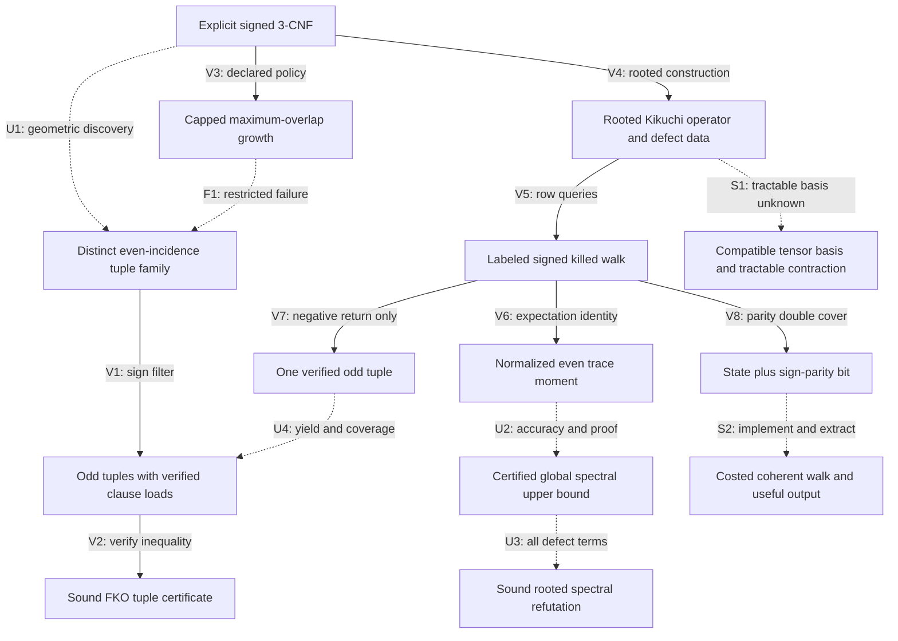

# Research meta-graph: evidence, transformations and open transitions

2026-09-11; S3068 user-directed addition. This is a persistent research ledger, not an executable quantum walk, a discovered holographic algorithm or a new complexity result. Nodes record a representation and its required query; edges record an established transformation, a restricted failure, or an unproved step. This small ledger is a different level from the exponentially large lifted-state graph inside the rooted-operator node. Double covers and quantum interference would act on that internal graph, not automatically on ledger arrows that may be lossy or noninvertible. The [novelty assessment](2026-09-11-fko-novelty.md) supplies the claim-level conclusion.

ROOTCERT is the complete rooted spectral certificate, distinct from the FKO tuple certificate CERT. V7 ends at one odd tuple; the unproved U4 edge must supply sufficient yield and verified clause coverage before V2 applies.

| Edge | Evidence and exact scope | Cost or outstanding obligation |
|---|---|---|
| V1 | Conditional sign filtering for a sign-blind selected family; FKO already uses this architecture. [S3065](2026-09-11-adaptive-fko.md) | Distinct tuple IDs, sign access, load checks; the probability theorem does not discover the family. |
| V2 | Given tuples and a certified spectral bound, the strict FKO inequality is pointwise sound. [S3064](2026-09-11-fko-discovery.md) | Compute imbalance, loads and a directed numerical upper enclosure; reject if the inequality is not established. |
| V3/F1 | Exact capped, maximum-overlap, uniform-tie, sign-blind policy is defined; its fresh-restart failure at K=Theta(n^(1/5)) is restricted to that policy and random model. [S3066](2026-09-11-focused-growth.md) | Charges failed attempts; does not cover larger exploration followed by pruning or history-based priorities. |
| U1 | Short useful tuple families exist at the FKO scale; our efficient finder is missing. | Support, distinctness, sufficient normalized mass and full construction time. |
| V4 | Existing rooted operator construction accounts for every input clause. [Operator source](2026-09-11-global-fko-sources.md) | Implicit input is compact; dimension binom(n,ell), diagonal trace and defect sums remain charged. |
| V5/V6 | Channel-labeled killed walks have polynomial local queries; signed return expectation equals tr(H^(2p))/N. [S3067](2026-09-11-global-fko.md) | Number of walks, length, exact transition probabilities, precision and failures. An expectation identity is not an upper certificate. |
| V7 | A negative closed 2p-step rooted walk reduces to at most 4p original clause IDs with odd parity. [S3067](2026-09-11-global-fko.md) | Verify original labels; no lower bound on useful return frequency or packing coverage. |
| U4 | One verified tuple is not yet a useful family. | Enough distinct outputs, support control and verified clause-load capacity. |
| U2/U3 | Statistical trace accuracy and complete pointwise refutation are different contracts. [S3067](2026-09-11-global-fko.md) | Dimension-dependent accuracy for the chosen moment route, independently sound upper proof, and every global defect term. |
| V8 | Familiar signed double cover records cumulative sign as a bit. | Twice as many graph states; does not itself accelerate finding an opposite-sheet return. |
| S1 | Holographic transformations can preserve tensor contractions under compatible changes of basis. | No simultaneously tractable transformed signatures/topology or cheap certified contraction has been shown for this operator. |
| S2 | A signed graph can define a coherent quantum evolution under an explicit implementation. | State preparation, oracle construction, normalization, evolution time, accuracy, measurement and usable certificate extraction are unproved here. |

## What holography or interference would add

A meta-graph can immediately make research more useful by retaining transformations, failed hypotheses, source links, costs and output guarantees. Adding an edge requires evidence; an earlier failed route is not silently restored by renaming its representation. Nodes in this ledger are different kinds of objects, so their adjacency is not automatically a unitary or Hamiltonian.

For the actual signed walk there is a more concrete, already known graph construction. Replace each state S by (S,0) and (S,1). A positive channel preserves the bit and a negative channel flips it. A negative closed walk in the original graph becomes a path from (S,0) to (S,1). For positive and negative adjacency parts A+ and A-, the lifted adjacency is A+ tensor I + A- tensor X. This is the standard signed double cover, not a new mechanism. [Brown et al., Section 5, equation 25](https://arxiv.org/pdf/1211.0505).

A sign-basis change separates the unsigned and signed sectors. It makes cancellation explicit; it does not prove that a useful negative path can be found or read out cheaply. A quantum walk would require an implementable normalized evolution and a success/output analysis. The current killed classical walk is not itself unitary, and a research-ledger edge is not a physical transition.

Here 'holographic' has a precise algorithmic meaning, distinct from physical holography. Valiant's Holant theorem preserves the appropriate global sum under compatible local basis descriptions, while matchgate constructions can make that sum a tractable weighted perfect-matching/Pfaffian computation in the required setting. Arbitrary tensor networks do not become easy simply by changing basis. All transformed local constraints must fit a tractable class together, with the required topology, and the basis and contraction must be obtained at charged cost. [Valiant, Theorem 4.1 and matchgrid definitions](https://people.seas.harvard.edu/~valiant/holographic11-07.pdf).

The useful open research question is therefore specific: can a representation change expose a simultaneously tractable global computation while preserving the needed all-input certificate or sufficiently detectable output? No such transformation or interference advantage has been established for these FKO instances. The graph records that obligation; it is not a proposal to run a new experiment or draft a paper.
