# Research meta-graph: evidence, transformations and open transitions

2026-09-11; S3068 user-directed addition, updated through S3076. This is a persistent research ledger, not an executable quantum walk, a discovered holographic algorithm or a new complexity result. Nodes record a representation and its required query; edges record an established transformation, a restricted failure, or an unproved step. This small ledger is a different level from the exponentially large lifted-state graph inside the rooted-operator node. Double covers and quantum interference would act on that internal graph, not automatically on ledger arrows that may be lossy or noninvertible. The [novelty assessment](2026-09-11-fko-novelty.md) supplies the claim-level conclusion.

```mermaid
flowchart TD
  CNF[Explicit signed 3-CNF]
  GEOM[Distinct even-incidence tuple family]
  ODD[Odd tuples with verified clause loads]
  CERT[Sound FKO tuple certificate]
  ROOTCERT[Sound rooted spectral refutation]
  ONE[One verified odd tuple]
  BASIS[Known full random-order greedy basis]
  CIRCUITS[List containing all short odd circuits]
  ENUM[Known connected-subset enumeration baseline]
  HALFLIST[Half-size unions of logarithmically many connected pieces]
  PRICE[Exact minimum-price short odd tuple oracle]
  PACK[Exact feasible approximate short-tuple packing]
  INDEX[Polynomial-gate padded half-index decoder]
  CLAW[Dyadic colored threshold claw]
  QQUERY[Bounded-error quantum price query]
  QRAG[Fast search with addressed quantum-memory gates]
  GATE[Historical direct-scan gate bound]
  ORDINARY[Explicit ordinary-gate weighted claw search]
  LOCAL[Capped maximum-overlap growth]
  ROOT[Rooted Kikuchi operator and defect data]
  WALK[Labeled signed killed walk]
  FREE[Labeled degree-normalized non-killed walk]
  START[Classical stationary start on good random inputs]
  ELIG[Necessary root-balanced parity eligibility]
  EXAMPLE[Finite nonempty retained label cycle]
  KILL[Suppressed killed-history output on good random inputs]
  DIRECT[Direct identity or Walsh planar-matchgate route]
  MOM[Normalized even trace moment]
  UPPER[Certified global spectral upper bound]
  DOUBLE[State plus sign-parity bit]
  TENSOR[Compatible tensor basis and tractable contraction]
  QUANT[Costed coherent walk and useful output]
  CNF -. U1: geometric discovery .-> GEOM
  GEOM -->|V1: sign filter| ODD
  ODD -->|V2: verify inequality| CERT
  CNF -->|V13: known basis processing| BASIS
  BASIS -->|V14: bounded-degree repetition bound| CIRCUITS
  CNF -->|V15: matching deterministic baseline| ENUM
  ENUM -->|V16: parity and sign checks| CIRCUITS
  CIRCUITS -. U6: historical packing gap closed by V19 .-> ODD
  CNF -->|V17: charged universal half-list| HALFLIST
  CNF -->|V21: reversible forest decoder| INDEX
  INDEX -->|V22: polynomial price-bit expansion| CLAW
  CLAW -->|V23: bounded-error query search| QQUERY
  CLAW -->|V24: explicit QRAG model| QRAG
  QQUERY -->|V25: amplified calls and exact checks| PACK
  QRAG -. U7: historical scan limitation .-> GATE
  CLAW -->|V26: dummy buckets plus heavy-pair search| ORDINARY
  ORDINARY -->|V27: amplified pricing and exact checks| PACK
  HALFLIST -->|V18: exact rational price query| PRICE
  PRICE -->|V19: polynomial-call rational packing| PACK
  PACK -->|V20: exact loads and robust-margin verification| ODD
  CNF -->|V3: declared policy| LOCAL
  LOCAL -. F1: restricted failure .-> GEOM
  CNF -->|V4: rooted construction| ROOT
  ROOT -->|V5: row queries| WALK
  WALK -->|F2: sampler-specific bound| KILL
  ROOT -->|V9: change normalization| FREE
  ROOT -->|V11: rejection preparation| START
  START -->|V12: classical walk start| FREE
  FREE -->|N1: output invariant only| ELIG
  EXAMPLE -->|E1: finite feasibility only| ELIG
  FREE -->|V10: negative return only| ONE
  FREE -. U5: mass and coverage .-> ODD
  CNF -. F3: direct route fails prerequisites .-> DIRECT
  WALK -->|V6: expectation identity| MOM
  WALK -->|V7: negative return only| ONE
  ONE -. U4: yield and coverage .-> ODD
  MOM -. U2: accuracy and proof .-> UPPER
  UPPER -. U3: all defect terms .-> ROOTCERT
  WALK -->|V8: parity double cover| DOUBLE
  ROOT -. S1: tractable basis unknown .-> TENSOR
  DOUBLE -. S2: implement and extract .-> QUANT
```

ROOTCERT is the complete rooted spectral certificate, distinct from the FKO tuple certificate CERT. V7 ends at one odd tuple; the unproved U4 edge must supply sufficient yield and verified clause coverage before V2 applies.

| Edge | Evidence and exact scope | Cost or outstanding obligation |
|---|---|---|
| V1 | Conditional sign filtering for a sign-blind selected family; FKO already uses this architecture. [S3065](2026-09-11-adaptive-fko.md) | Distinct tuple IDs, sign access, load checks; the probability theorem does not discover the family. |
| V2 | Given tuples and a certified spectral bound, the strict FKO inequality is pointwise sound. [S3064](2026-09-11-fko-discovery.md) | Compute imbalance, loads and a directed numerical upper enclosure; reject if the inequality is not established. |
| V3/F1 | Exact capped, maximum-overlap, uniform-tie, sign-blind policy is defined; its fresh-restart failure at K=Theta(n^(1/5)) is restricted to that policy and random model. [S3066](2026-09-11-focused-growth.md) | Charges failed attempts; does not cover larger exploration followed by pruning or history-based priorities. |
| U1 | Historical geometric-discovery gap; S3073 supplies a charged subexponential pricing/packing route V17-V20. | Polynomial discovery and a worst-case P-versus-NP bridge remain unproved; this does not resolve walk-specific U4/U5. |
| V4 | Existing rooted operator construction accounts for every input clause. [Operator source](2026-09-11-global-fko-sources.md) | Implicit input is compact; dimension binom(n,ell), diagonal trace and defect sums remain charged. |
| V5/V6 | Channel-labeled killed walks have polynomial local queries; signed return expectation equals tr(H^(2p))/N. [S3067](2026-09-11-global-fko.md) | Number of walks, length, exact transition probabilities, precision and failures. An expectation identity is not an upper certificate. |
| V7 | A negative closed 2p-step rooted walk reduces to at most 4p original clause IDs with odd parity. [S3067](2026-09-11-global-fko.md) | Verify original labels; no lower bound on useful return frequency or packing coverage. |
| U4/U5 | One verified tuple is not yet a useful family. Neither non-killed normalization nor stationary preparation establishes aggregate weighted return mass. [S3070](2026-09-11-nonkilled-return.md) | Bound nonempty root-balanced, retained-realizable parity-return mass and capacity-controlled outputs. An inverse-polynomial mass targets polynomial sampling; a weaker quantified improvement over existing search is also meaningful. |
| V11/V12 | Uniform state/root rejection samples classical pi(S) proportional to retained degree. On the specified iid-input and uniform-root good event, expected proposals are O(n^(13/5)), each polynomial work. [S3070](2026-09-11-nonkilled-return.md) | Shared input exception is o(1); finite caps report no output. This proves classical access, not useful return mass or efficient coherent preparation. |
| N1 | Every closed-history selector q obeys Bq=0 and Rq=0. This is necessary eligibility, not a generator or sufficient retained realization. [Retained-cycle audit](2026-09-11-retained-cycle-audit.md) | A fixed degree-two e-clause cover survives independent random rooting with probability PM(dual)/3^e <=3^(-e/2). No aggregate scarcity or adaptive-cover bound follows. |
| E1 | The finite four-clause K4 dual example has two parallel retained channels with a nonempty label cycle. [S3070](2026-09-11-nonkilled-return.md) | Establishes feasibility only, not random-input frequency, short useful mass or coverage. Preserve channel labels rather than only aggregated matrix signs. |
| F2 | On the specified iid-support, independent uniform-root good event, killed-history output is at most exp(-Omega(n^(1/5) log log n/log n)) per trajectory. [Reviewed S3069](2026-09-11-interference-extraction.md) | Shared input exception is only o(1). Uniform over starts on that fixed operator; standard tagged-sampler amplification is scoped separately. Not an interference or quantum lower bound. |
| V9/V10 | Normalize by retained degree instead of G+d_*, retaining channel labels; a negative closed L-step return still gives one verified odd tuple of size at most 2L. [S3069](2026-09-11-interference-extraction.md) | Restart isolated rows; charge row queries and readout. This is a different operator, so H_ref trace and spectral bounds do not transfer. |
| F3 | The direct incidence-network identity/Walsh standard planar-matchgate attempt fails its signature/topology prerequisites. [Holographic companion](2026-09-11-holographic-extraction.md) | Does not exclude arbitrary bases, gadgets, other representations or specialized coefficient methods. Code-enumerator reformulation alone has no cheaper contraction. |
| U2/U3 | Statistical trace accuracy and complete pointwise refutation are different contracts. [S3067](2026-09-11-global-fko.md) | Dimension-dependent accuracy for the chosen moment route, independently sound upper proof, and every global defect term. |
| V8 | Familiar signed double cover records cumulative sign as a bit. | Twice as many graph states; does not itself accelerate finding an opposite-sheet return. |
| S1 | Holographic transformations can preserve tensor contractions under compatible changes of basis. | No simultaneously tractable transformed signatures/topology or cheap certified contraction has been shown for this operator. |
| S2 | A signed graph can define a coherent quantum evolution under an explicit implementation. | State preparation, oracle construction, normalization, evolution time, accuracy, measurement and usable certificate extraction are unproved here. |

## What holography or interference would add

A meta-graph can immediately make research more useful by retaining transformations, failed hypotheses, source links, costs and output guarantees. Adding an edge requires evidence; an earlier failed route is not silently restored by renaming its representation. Nodes in this ledger are different kinds of objects, so their adjacency is not automatically a unitary or Hamiltonian.

For the actual signed walk there is a more concrete, already known graph construction. Replace each state S by (S,0) and (S,1). A positive channel preserves the bit and a negative channel flips it. A negative closed walk in the original graph becomes a path from (S,0) to (S,1). For positive and negative adjacency parts A+ and A-, the lifted adjacency is A+ tensor I + A- tensor X. This is the standard signed double cover, not a new mechanism. [Brown et al., Section 5, equation 25](https://arxiv.org/pdf/1211.0505).

A sign-basis change separates the unsigned and signed sectors. It makes cancellation explicit; it does not prove that a useful negative path can be found or read out cheaply. A quantum walk would require an implementable normalized evolution and a success/output analysis. The current killed classical walk is not itself unitary, and a research-ledger edge is not a physical transition.

Here 'holographic' has a precise algorithmic meaning, distinct from physical holography. Valiant's Holant theorem preserves the appropriate global sum under compatible local basis descriptions, while matchgate constructions can make that sum a tractable weighted perfect-matching/Pfaffian computation in the required setting. Arbitrary tensor networks do not become easy simply by changing basis. All transformed local constraints must fit a tractable class together, with the required topology, and the basis and contraction must be obtained at charged cost. [Valiant, Theorem 4.1 and matchgrid definitions](https://people.seas.harvard.edu/~valiant/holographic11-07.pdf).

The useful open research question is therefore specific: can a representation change expose a simultaneously tractable global computation while preserving the needed all-input certificate or sufficiently detectable output? No such transformation or interference advantage has been established for these FKO instances. The graph records that obligation; it is not a proposal to run a new experiment or draft a paper.

## S3069 update and live boundary

The reviewed killed-sampler result diagnoses the chosen normalization, not intrinsic witness sparsity. The separate FREE node removes that normalization penalty while preserving original-clause witness verification. V10 still ends at ONE, and U5 remains unproved: return probability must exclude parity-empty backtracking, and enough useful outputs must survive clause-load checks. The extra edge to ODD is an unresolved combined yield-and-coverage obligation, not a demonstrated transformation.

The holographic companion checks a direct coefficient representation of short odd tuples. Its identity/Walsh and direct-planarity failures are F3 only; S1 remains speculative rather than refuted. Neither a changed basis nor the non-killed walk is recorded as an improved FKO finder. An improved random-input finder would still lack the worst-case bridge needed for P versus NP.

Evidence: [main derivation and three-lens table](2026-09-11-interference-extraction.md), [prior quantum output contract](2026-09-11-interference-prior-art.md), and [direct holographic assessment](2026-09-11-holographic-extraction.md). [Final independent claims-scope inspection](2026-09-11-interference-nonclaims-review.md) is GO for this ledger update; no executable graph, experiment or novelty conclusion is added.

## S3070 update: eligibility and classical access, not a finder

N1 is an invariant edge: it says what every output must satisfy, not that the walk efficiently produces such an output. Ordinary even-cover existence is insufficient to establish root balance or retained realization. The fixed-cover perfect-matching calculation cannot be applied to a root-adaptively selected family, nor can its exponential suppression be summed without accounting for all candidates. E1 explicitly rules out an all-cycles-cancel interpretation while making no distributional claim.

V11 closes a classical preparation-cost obligation on the declared random good event. It does not establish a quantum state-preparation advantage. U5 remains the substantive unresolved aggregate mass-and-coverage transition, and no new finder or novelty claim is recorded. No next sampler variant is selected. See the [main three-lens table](2026-09-11-nonkilled-return.md) and [global-alternatives comparison](2026-09-11-nonkilled-alternatives.md). [Final independent non-claims inspection](2026-09-11-nonkilled-nonclaims-review.md) is GO for this graph update.

## S3071 selection note: no additional verified edge

The [structured-code selection](2026-09-11-frontier-code-selection.md) and [aggregate-packing selection](2026-09-11-frontier-packing-selection.md), checked in the [independent selection review](2026-09-11-frontier-selection-review.md), select no supported new mechanism. Generic decoding exponents, implicit pricing, and short-cover existence have not supplied an applicable aggregate improvement. This is an evidence-limited selection outcome, not an all-method barrier or a claim that no such algorithm exists. U1, U4 and U5 remain open; no extra verified transformation is added.

The code note records one unselected proof question about a known full-matrix random-priority greedy-basis/fundamental-circuit heuristic. Its sparse pivot-survival and aggregate-load estimates are unproved here, and it is distinct in scope from the prior variable-restriction and capped local-growth bounds. Recording it does not select a campaign, confer novelty or count it as progress toward a finder.

## S3072 update: recovered circuits, matching known baseline

The [greedy-basis analysis](2026-09-11-greedy-basis.md) derives a bounded-degree sufficient-event probability and repeats known basis processing to recover every short circuit with stated high probability. V14 concerns that recovery contract only, at (O(Delta))^k times polynomial factors; it is not a polynomial finder. The [source comparison](2026-09-11-greedy-basis-sources.md) identifies an already available deterministic connected-subset algorithm with the same degree-based leading exponent (V15/V16). Thus these are analysis/baseline edges, not a new speedup. [Final independent claims-scope review](2026-09-11-greedy-basis-nonclaims-review.md) is GO for this update.

| New edge | Evidence and exact boundary |
|---|---|
| V13/V14 | Full random-priority Gaussian basis processing is known. On a fixed maximum-degree-Delta input, the sufficient isolation event recovers an e-clause circuit with probability at least [exp(-3/4)/(3Delta)]^e. Independent repetition and a union bound recover all circuits of size at most k. The random-input degree event is paid once. |
| V15/V16 | Minimal circuits are connected in the clause-intersection graph. Patel-Regts Lemma 2.4 lists all connected subsets up to k in O(M k^3 (exp(1) d)^k), d=max(1,3(Delta-1)); exact parity/sign filtering supplies the circuit-containing list. This matches the displayed degree exponent deterministically. |
| U6 | An odd tuple has an odd minimal component; replacing tuples by components preserves fractional mass without increasing clause loads. Computing a packing, numerical accuracy, strict spectral slack and exact certificate verification are separate obligations. No full end-to-end packing/refutation bit-runtime is established or pursued in this attempt. |

No novelty, strongest-baseline advantage, quantum speedup or achieved P-versus-NP stepping stone is recorded. The numerical-packing caveat is an explicit boundary, not an automatic new work item.

## S3073 update: reviewed deterministic pricing and packing

The [main derivation and three-lens table](2026-09-11-connected-half-pricing.md) adds an actual discovery mechanism, not merely an unproved arrow. Every short minimal weight-three circuit has balanced halves with O(log k) connected pieces. Enumerating all such possible halves, retaining exact incidence/sign/cardinality keys and recomputing price minima supplies an exact minimum-price oracle for all nonempty odd even-incidence supports of size at most k. Nonnegative rational prices and symmetric-difference verification are essential. The list need not enumerate every output tuple.

| Edge | Reviewed guarantee and charged conditions |
|---|---|
| V17 | Universal half coverage via the independently cross-checked cubic-pairing/tree partition. List preparation costs M^{O(log k)} 2^{O(k)} max(1,Delta)^{floor(k/2)} times polynomial original-input factors; no unknown witness tree or full-input decomposition is supplied free. |
| V18 | Exact minimum nonnegative rational price over all short odd tuples, or correct absence report. Syndrome/sign/cardinality bucket scans are linear in list length times polynomial factors, including bit costs; no quadratic list join. |
| V19 | Polynomially many adaptive price calls produce exactly feasible rational packing mass at least W_all/(1+epsilon). All original-clause loads, weight lengths and output sizes are charged, with polynomial inverse-epsilon dependence. This closes the former numerical-packing gap U6 through the new list route. |
| V20 | Source FKO robust witnesses give W_0>2H and W_0>=1. Epsilon=1/2 and a directed H enclosure of additive error at most 1/8 retain strict margin. Exact rational matrix bisection and certificate checks are polynomial bit work. Success is with high probability for sufficiently large fixed density constant and source-dependent k; verification is sound on every input. |

At M=Theta(n^(7/5)), Delta=O(n^(2/5)) and k=Theta(n^(1/5)), the upper logarithmic runtime is (1/5)k log n+O(k)+O((log n)^2), with constant epsilon. The same-cap full connected-set baseline has upper leading term (2/5)k log n. This comparison is checked only against that explicit baseline. The source's sampling model transfers to iid signed clauses through an O(M^2/n^3) collision exception; the degree event is charged separately. Exact support constants and other refuters' output contracts matter to broader comparisons.

[Source ancestry](2026-09-11-connected-half-sources.md) includes known cluster enumeration, signed syndrome joins and packing methods. No priority, literature-wide fastest result, quantum speedup, publication readiness or P-versus-NP conclusion is established. U4/U5 remain open for their actual walk samplers; V17-V20 do not bound those return distributions. The structural contributor's partition proof was checked by a different reviewer, and the pricing/wrapper received separate proof review. Final independent non-claims inspection of this updated ledger is GO in the [review record](2026-09-11-connected-half-nonclaims-review.md).

## S3074 update: indexed quantum queries and their memory model

The [reviewed quantum construction](2026-09-11-half-list-quantum.md) supplies an explicit padded forest-index decoder; no N-entry half list is supplied as quantum input. Its local evaluation is polynomial in the original input. That fact does not remove the much larger quantum walk working memory.

| Edge | Evidence and exact resource contract |
|---|---|
| V21 | Padded plane-forest/root/neighbor encodings cover the required halves with N=M^{O(log k)}2^{O(k)}D^{floor(k/2)} times polynomial factors. Invalid indices and duplicate descriptions count in N. Polynomial bounded decoding retains its index and uncomputes scratch; original-input table scans are charged. |
| V22 | Dyadic interval/prefix keys reduce summed nonnegative integer price thresholds to true cross-side equality with polynomial price-bit expansion. Same-side duplicates and invalid tags never count as claws. |
| V23 | Established quantum search gives N^{2/3} times polynomial factors in decoder queries. Threshold bisection and all adaptive packing rounds have an explicit amplified error budget. This is a query statement, not an ordinary circuit-time statement. |
| V24 | In the explicitly augmented quantum random-access-gate model, generic history-independent data structures give N^{2/3} times polynomial time and coherent-record memory. Setup, updates, extraction, seed lengths and fixed-time cutoffs are charged. The reviewed hybrid uses fixed-input seed tails and seed-independent ideal amplitudes, not a seed good for all subsets. |
| V25 | On the allocated search-success event, price calls meet the S3073 oracle contract and hence its packing bound. Every final tuple, load, mass and directed spectral inequality is checked exactly. Search failure can withhold a certificate but cannot justify a false refutation. |
| U7 | The direct ordinary-gate scan simulation has an N^{4/3} times polynomial upper bound at the chosen walk size. No improved ordinary-gate time is proved; this is not a lower bound against other implementations. |

At the FKO scaling, the query bound and separately the QRAG-model time bound have upper leading logarithmic term (2/15)k log n. This does not establish a physical quantum advantage, a fastest-known refuter or a P-versus-NP conclusion. Its gate-model boundary is substantive; polynomial access to one generated half is distinct from addressed access to exponentially many evolving quantum records.

The [novelty assessment](2026-09-11-half-list-novelty.md) retains unverified priority and strongest-algorithm status. Known cluster, syndrome-join and quantum-search ingredients are credited; no paper or implementation is selected by this ledger. Proof and complexity reviews cross-check contributor-owned reductions, and the generic data-structure repair is included. Final independent claims-scope inspection of this graph update is GO in the [non-claims review](2026-09-11-half-list-nonclaims-review.md).

## S3075 selection: real low-gate precedent, transfer unproved

The [ordinary-gate selection audit](2026-09-11-quantum-gate-selection.md) identifies Jaques-Schrottenloher's SAC 2020 golden-collision algorithm: a genuine approximately N^(6/7) ordinary-gate result, with substantial memory, in its random-function setting. This prevents interpreting U7 as an all-method impossibility. However, the inspected predecessor/marked-state argument has not been transferred to the exact duplicate-rich, weighted cross-side half decoder.

Output hashing preserves equal-key fibers. Canonical descriptions and unique invalid tags might remove encoding artifacts, but do not establish the required semantic multiplicities, retained optimal claw, random-iteration law or charged preparation. A random original formula is not automatically a random function on generated indices. The proposed transfer obligation is recorded in the audit, with no algorithm gain assumed.

U7 therefore remains open. No new verified transformation or theorem is added; the existing query/QRAG result is unchanged. [Independent source/scope review](2026-09-11-quantum-gate-review.md) is GO for this selection, the main note and this ledger update. No novelty, strongest-algorithm claim, implementation or goal completion follows from the selection.

## S3076 update: U7 discharged in the ordinary active-gate model

The [golden-transfer derivation](2026-09-11-golden-transfer.md) provides an explicit alternative to the old addressed-memory implementation. The previous U7 scan bound remains true for that implementation; its general access obligation is now discharged by V26-V27 in the stated theoretical model. Mathematical proof and complexity reviews are GO; [final independent non-claims inspection](2026-09-11-golden-transfer-nonclaims-review.md) is GO for this main/ledger update.

| Edge | Guarantee and conditions |
|---|---|
| V26 | On arbitrary fixed weighted colored keys, heavy useful fibers supply enough exact cross pairs for bounded pair search. For light useful fibers, pairwise key hashing and a deterministic dummy reservoir give a sufficiently small target bucket with constant seed probability and a density floor for every bucket. Fixed-point preparation, a product-tuple heat-bath walk, linear coordinate swaps and reversible sorting charge all ordinary gates. No random-function oracle, cheap QRAM, injectivity or independent-key premise is used. |
| V27 | Bounded-error threshold search costs N^(6/7) times polynomial factors in ordinary active gates, with N^(2/7) times polynomial quantum space. Polynomial adaptive pricing calls have a combined error budget and fresh explicit seeds. Exact original-clause, load, mass and spectral verification prevents false refutations even when search fails. |

At the same FKO support cap, the gate upper logarithmic leading term is (6/35)k log n and the quantum-space term is (2/35)k log n. The previously established robust-witness distributional application and its exceptions remain explicit; this is not a worst-case polynomial SAT algorithm. Active gates count idle memory as free: no physical, fault-tolerant or depth-width advantage is inferred.

SAC 2020 Section 3.5 already supplies the prefix architecture and N^(6/7) exponent. This increment derives a transfer for the indexed arbitrary-fiber query and charges its implementation; novelty and fastest status are unverified. The predecessor-based route itself is not proved, and this result does not provide the unresolved negative-return distributions of U4/U5. It introduces no publication, experiment or claim of completing the continuing goal.

## S3077 selection: park the quantum-method route

The [novelty audit](2026-09-11-gate-transfer-novelty.md), [application significance assessment](2026-09-11-gate-transfer-significance.md) and [independent source review](2026-09-11-gate-transfer-source-review.md) preserve V26-V27 as reviewed mathematical guarantees. SAC 2020 already supplies the exponent and prefix architecture; the inspected sources do not establish priority or fastest-known status for our transfer/application. The random-FKO application remains within the previously known exp(O(n^(1/5) log n)) broad runtime order. No established implication to P = NP or P != NP follows.

Selection: park further quantum-method refinement and repeated novelty searches pending a distinct supported mechanism. A uniform deterministic polynomial-time refutation finder complete for every unsatisfiable CNF would have a direct P = NP implication through a known polynomial timeout and sound verification. No mechanism meeting that target is identified here; it is a missing target, not a claimed stepping stone supplied by V26-V27. The worst-case bridge and research selection remain unresolved. This note adds no algorithmic edge, implementation or goal-achievement claim. Final combined source/significance inspection of this ledger addition is GO in the linked independent review.

## S3078 selection: direct implication, no supported mechanism

The [direct-magnification assessment](2026-09-11-direct-magnification-selection.md) verifies the existing OPS Theorem 1.4 implication: for its universal c, one epsilon>0 and every sufficiently small fixed beta>0, Gap-MCSP[2^(beta n)/(c n),2^(beta n)] outside general Circuit[N^(1+epsilon)], N=2^n, implies NP outside P/poly and hence P != NP. The archived Lean frontier map stores this kind of implication as data; it does not prove its antecedent.

One explicitly conditional proposal was tested: a promise-preserving coordinate embedding combined with syntactic gate shrinkage faster than the truth-table input shrinkage. The natural duplication embedding does not establish the necessary NO-promise amplification, because the source threshold M^beta is below the target N^beta. No supported replacement embedding or gate-shrinkage estimate emerged. Selection is NONE. This adds no verified lower-bound edge, new theorem or universal impossibility claim; all preceding verified edges remain unchanged. [Independent review](2026-09-11-direct-magnification-review.md) is GO for the bounded main assessment and this ledger addition; it does not certify the proposed lower-bound lemma.

## S3079: fixed-threshold feasibility, shrinkage still unproved

The [fixed-threshold derivation](2026-09-11-fixed-threshold-restriction.md) repairs the preceding promise mismatch: unsigned truth-table duplication preserves exact absolute circuit thresholds L,T over the declared B2 basis. Explicit circuit counting yields a stopping table length M of order T log(n+T)+L and a linear separator base bound. Proof and complexity reviews are GO for these facts and the conditional calculation; no shrinkage inequality is verified.

Proposed R concerns minimum-size separators only over the finite slab q0(n,beta)<q<=n generated by the original thresholds. If the specified gate simplification saved a factor 2^(1+epsilon) at every step, the reviewed consequence would have exponent 1+epsilon(1-beta), sufficient for the existing OPS implication with a smaller fixed exponent. This is a conditional proposal, not a new lower-bound edge. A perpetual fixed-T version would contradict a near-linear enumeration upper bound and is explicitly excluded.

The next bounded analytic test is an unproved charge on gates that coincide or simplify under the q coordinate identifications. No positive charge estimate, experiment or mechanism-success claim is selected by this ledger. Prior verified edges remain unchanged; the continuing goal is not achieved. [Final independent non-claims inspection](2026-09-11-fixed-threshold-nonclaims-review.md) is GO for this update.

## S3080: park the failed witness-to-diagonal charge

September 12, 2026 closeout metadata; September 11 filenames retain task continuity. The [gate-charge attempt](2026-09-11-separator-gate-charge.md) defines exact retained-record losses, including sharing and output-cone pruning. Minimum separator size supplies promised critical witnesses, but transporting them through cofactors does not preserve the exact NO threshold: the explicit multiplexer estimate only guarantees a hard cofactor from complexity greater than 2T+3, while the promise requires merely greater than T. Criticality preservation and semantic-to-syntactic record coincidence are also unproved.

Proof and complexity reviews are GO for this failed-argument assessment. No quantitative positive loss, shrinkage R or counterexample to R is established. Park this witness-to-diagonal approach; no further parameter/schema continuation is selected. Earlier verified facts and conditional implications remain unchanged, with no new lower-bound edge or goal-achievement claim. [Final independent non-claims inspection](2026-09-11-separator-gate-nonclaims-review.md) is GO for this main/ledger update.

## S3081: park the tested prefix-reconstruction construction

September 12, 2026. The [separator-compression audit](2026-09-12-separator-compression.md) tests description-prefix existence W(f,p), not just truth-table recognition. A Gap-MCSP acceptance bit does not answer that predicate or guarantee an L-gate witness on accepted gap inputs. Compiling the verifier produces a polynomial-size circuit but an exponentially expanded truth table; under literal fixed-beta reuse, the new YES threshold also exceeds the verifier size, so its satisfiability is not distinguished. This last elementary diagnostic has a scoped independent proof GO linked in the main record.

The tested reconstruction and rank-label ideas supply no charged decoder forcing separator failure. Successful search-to-decision results for formulas and compressor consequences for NEXP retain their distinct models and conclusions. Park this construction; no MCSP search-to-decision campaign or other next mechanism is selected. No general impossibility, OPS lower bound or goal-achievement edge is added. Final independent source/scope review and [non-claims inspection](2026-09-12-separator-compression-nonclaims-review.md) are GO; previous verified facts remain unchanged.

## S3082: reject a pure-space streaming transfer before derivation

The [gap-first selection](2026-09-12-gap-first-selection.md) tests one proposed application: current linear-space CSP streaming lower bounds to the MMW MCSP joint space/update-time frontier. For polynomial-in-n circuit thresholds and n=O(log m), the known short-PH-oracle MCSP streamer becomes a polylog(m)-space ordinary streamer if arbitrary update time is allowed. The current CSP theorem also allows arbitrary update computation. Thus a one-pass answer-preserving reduction with o(m) total composed workspace would contradict that known space bound, regardless of its update speed.

Selection NONE for this purely space-preserving transfer in the stated regime. This is a source-model compatibility rejection, not a general reduction impossibility or novel barrier. A time-sensitive transfer remains an unfilled obligation, with no supported mechanism selected. No quantum, gate-charge or prefix-reconstruction route is reopened; no achieved P-versus-NP edge is added. Independent [source/scope review](2026-09-12-gap-first-selection-review.md) is GO for this assessment and graph update.

## S3083: reject universal external-field de-biasing

The [constructive mechanism test](2026-09-12-constructive-mechanism.md) examines a prospective use of Barvinok's August 2026 zero-free theorem: evaluate strongly field-biased soft SAT partitions, then remove the bias with a small universal linear stencil of field centers. For finite-temperature unit-clause singleton formulas, the exact center-response matrix is a positive scalar multiple of an invertible Boolean-noise kernel. Exact universal reconstruction therefore requires all 2^n centers, even with signed weights. At the theorem-certified strong bias and the specified SAT-sensitive temperature, a normalized nonnegative stencil omitting any center also fails constant-relative-error reconstruction.

Selection NONE for this stencil. These easy formulas falsify the proposed universal identity; they are not a hard SAT family. Formula-dependent or nonlinear algorithms and symbolic aggregate computations are not excluded. The known single-center evaluation bound is additionally quasipolynomial, so cheap center aggregation alone would not supply a polynomial SAT solver. No novel application, lower-bound edge or publication candidate is established. [Proof review](2026-09-12-constructive-mechanism-proof-review.md) is GO for main and graph; [complexity/source review](2026-09-12-constructive-mechanism-complexity-review.md) is GO for the main; [final nonclaims review](2026-09-12-constructive-mechanism-nonclaims-review.md) is GO for this bounded main/graph assessment. Publication remains HOLD. Previous verified edges remain unchanged and the overall goal is unresolved.

## S3084: reject constant-image certificate compilation

The [proof-discovery assessment](2026-09-12-proof-discovery-mechanism.md) tests a proposed use of the 2026 constant-image IPS work. A CNF has a polynomial-size Boolean violation aggregate p, but its constant inverse on UNSAT inputs does not construct the required Boolean-ideal correction for 1-p. The source itself distinguishes functional inversion from full proof complexity. Shifting to 2-p permits a cheap inverse and Booleanity correction for every CNF, so the shifted refutation loses the SAT decision.

Selection NONE. The elementary diagnostics and exact deterministic discovery/checking contract add no new algorithmic edge, novel theorem, separation or publication-ready contribution. The general 1-p correction remains unconstructed; no automatic successor campaign is selected. [Independent proof review](2026-09-12-proof-discovery-proof-review.md) and [complexity/source review](2026-09-12-proof-discovery-complexity-review.md) are GO for the bounded main assessment; [final nonclaims review](2026-09-12-proof-discovery-nonclaims-review.md) is GO for main and this graph update. Publication remains HOLD. These are agent reviews, not Lean verification or independent human validation. Existing verified edges remain unchanged and the overnight objective remains unresolved.

## S3085: product forcing unresolved; corrected-source PPSZ arithmetic verified

The [witness-discovery assessment](2026-09-12-witness-discovery-mechanism.md) tests a product-kernel auxiliary ordering measure. Path normalization, pair marginals, additive entropy and the cycle correction are derived, but aggregate forcing under root/ancestor conditioning is unproved. Scheder already discussed the Markov-chain mechanism and its conditional-dependence difficulty. No new SAT discovery operation or improved product-measure success bound is established.

Independent source comparison identified that the July 2026 recombination paper uses the earlier ECCC structural factor and regular coefficients, whereas Scheder's 2022 full version explicitly corrects the C19 edge-cut issue and associated estimates. This mismatch does not itself refute the July SAT theorem. A separate [exact rational certificate](2026-09-12-corrected-ppsz-certificate.py), with [saved output](2026-09-12-corrected-ppsz-certificate.json), recombines the corrected imports at epsilon_R=.1 and epsilon_I=.073. It certifies limiting bonus gamma_* in [0.0000684193054602820920, 0.0000684193054602820921], supporting gamma=.0000684193 and conditional unique-case runtime O*(1.306969924^n) after finite-strength error. These are imported-estimate consequences, not independently proved source theorems; no useful explicit w or n0, new general-case numerical base, optimality or priority is supplied.

[Independent proof review](2026-09-12-witness-discovery-proof-review.md) and [source/complexity review](2026-09-12-witness-discovery-complexity-review.md) are GO for that scoped consequence. Product forcing remains INCOMPLETE. A [standalone computational reproduction draft](ppsz-recombination-public/README.md) is prepared; the [final public claims review](2026-09-12-witness-discovery-nonclaims-review.md) recommends PUBLISH for curated snapshot fa16d31e620af06d965225a85938c766d3a89950, subject to the root planning decision. Known ingredients do not preclude a useful reproduction artifact, but no publication or P-versus-NP advancement is inferred from the arithmetic pass. No executable graph edge is added. Previous verified edges remain unchanged and the overall overnight objective is unresolved.

## S3087: conditional-message cancellation; improved forcing remains incomplete

The [conditional-forcing attempt](2026-09-12-conditional-forcing.md) derives a path-length-independent error bound for individual threshold revelations with one exact root placement: at epsilon<=.1 the second-order error is at most min(2*epsilon^2*(1-2r)^2, 5*epsilon^2*r) below one half, and threshold bits are exactly independent above saturation. A conservative full-CCT forcing bound follows by conditional domination on distinct labels, legitimate antichain splitting and a complete-tree recurrence. It accounts for all roots but discards sibling gain, so cannot improve the baseline after entropy cost.

An actual unique-CNF height-two CCT has cut AB OR CD with repeated c,d labels; it invalidates transferring clean-occurrence pivotal derivatives directly to a shared-label perturbation. Its preexisting repeated-label surplus means it is not a counterexample to surplus-aware cleanup or improved forcing. An exact isolated-triple replacement retains favorable signed contributions, but root-conditioned fields invalidate assuming those signs at every hybrid step. The note specifies the exact product-weight mixed second derivative whose aggregate negative part remains uncontrolled, alongside the still-needed first-order transfer and finite-height/epsilon compatibility.

No improved product-measure SAT guarantee, new executable edge, polynomial witness mechanism, lower bound, or P-versus-NP result is added. Full forcing improvement and the overnight objective remain INCOMPLETE. [Proof review](2026-09-12-conditional-forcing-proof-review.md) and [source/complexity review](2026-09-12-conditional-forcing-complexity-review.md) are GO for equations (1)-(10) within their stated local and path-forest scope. [Non-claims review](2026-09-12-conditional-forcing-nonclaims-review.md) is GO for this bounded record and HOLD for publication of the new incomplete mechanism. All three actual reviews are complete; their scoped GO does not upgrade the INCOMPLETE forcing result. The main note records the three-lens table. These are agent mathematical reviews, not Lean verification or human peer review.

Publication status correction for S3086: the separate imported-estimate reproduction was published as [ppsz-recombination-certificate v1.0.0](https://github.com/Quantyra/ppsz-recombination-certificate/releases/tag/v1.0.0), curated snapshot fa16d31. This supersedes the earlier pending-publication wording above. S3087 changes no public artifact and does not count that completed reproduction as a new forcing mechanism.

## S3088: support contraction and a depth-uniform template comparison

The [mixed-interaction charge](2026-09-12-mixed-interaction-charge.md) marginalizes unused labels exactly: an off-support path of length L becomes a kernel with coefficient theta^L*(3/32)^(L-1). A martingale-score calculation bounds the complete integrated second derivative by .025 times retained support size; this preserves disconnected supported interactions, which need not cancel. The resulting .0125*epsilon^2*sum_x K_x affine remainder still has an unbounded CCT-height cost.

A distinct threshold-translation coupling compares the actual shared-label cut law to its sequential conditional first-order template with aggregate error at most 4*n*epsilon^2, uniformly in finite CCT depth. The proof includes the moving exact-root field and uses fixed distinct-label reveal orders. This is a new bounded analytic edge from the actual path measure to root/threshold/order-specific proof comparison laws, not a common new algorithmic permutation measure. Entropy stays charged to the original path measure.

The template's event probability is nonlinear in epsilon. No depth-uniform template-to-affine remainder, favorable aggregate template forcing bound or jointly successful bias/height/implication-strength choice is proved. Same-H equality of first derivatives with source additive kernels does not transfer a coefficient from a lower bound against a smaller baseline when the actual independent CCT has surplus. Full improved PPSZ forcing remains INCOMPLETE; publication HOLD. No executable SAT edge, novel-algorithm claim, P-versus-NP result or public-v1 change is added.

[Proof review](2026-09-12-mixed-charge-proof-review.md), [source/complexity review](2026-09-12-mixed-charge-complexity-review.md) and [non-claims review](2026-09-12-mixed-charge-nonclaims-review.md) are complete and support GO for local preservation of the bounded record. These are three independent AI-agent reviews, distinct from the manuscript author, not Lean verification or external human peer review. A hypothetical positive coefficient alone would not certify improvement over the corrected-source bonus after the stated quadratic and finite-height costs; quantitative slack remains unproved.

## S3089: park universal source-relative replacement and generic interpolation

The [source-relative comparison](2026-09-12-source-relative-comparison.md) retains the full component-linear source baseline and derives the exact entropy saving KL(A||P) for same-edge-marginal path replacement. An actual six-variable unique-CNF aggregate height-two CCT certificate loses order epsilon^2 under replacement while its entropy saving is bounded by order epsilon^4. The resulting cut-minus-entropy objective decreases for every positive interpolation between the two laws at epsilon<=.1. Source TwoCC preprocessing excludes the diagnostic's selected edges; this is a failure of an unrestricted aggregate-CCT comparison, not a source-classified actual-forcing counterexample.

A separate cyclic-group family satisfies the source one-shot critical-clause closure and low-label conditions with an admissible H_low consisting entirely of triangles, so no universal positive density of replaceable path components follows for the unchanged source selection. The family is explicitly easy: seven clauses imply each variable. It does not obstruct a surplus-aware worst-case theorem. Generic two-sided entropy interpolation yields only a conditional local derivative criterion; no nonvanishing or linear-in-n gain is proved, and that familiar optimization is not selected as a new mechanism.

Disposition PARK for this proposed universal replacement/interpolation route pending genuinely new source-class information. No improved PPSZ exponent, worst-case impossibility, new algorithmic edge or publication-ready contribution is established. [Proof review](2026-09-12-source-relative-proof-review.md), [source/complexity review](2026-09-12-source-relative-complexity-review.md) and [non-claims review](2026-09-12-source-relative-nonclaims-review.md) are complete and GO for preservation of this bounded assessment. The main records the three-lens table and reviewer-contribution disclosure. These are three distinct AI-agent assessments, not Lean verification or external human peer review. Improved forcing remains INCOMPLETE; publication HOLD, broader objective ACTIVE, public v1 unchanged. Earlier reviewed analytic edges remain intact.

## S3090: reject two tested frontier operations

The [constructive catalytic test](2026-09-12-frontier-constructive.md) rejects arbitrary equal-weight witness collisions as a universal net-compression predicate: its easy tautology example covers the full catalyst cube, and restoration charges all distinguishing state. Its exact prefix-minimum threshold repair decides SAT under the broad semantic-completion promise. Neither test rules out hybrid early exits or smaller actually reached decoder images; no general catalytic impossibility or algorithm is proved.

The [structural weak-rank test](2026-09-12-frontier-structural.md) derives a negative square for the unchanged bamboo-tree SA functional with m=n^2, using a k-subset character Gram block inside its row-degree domain. This excludes reuse of those moments as a positive SoS functional through the displayed degree. It supplies no lower bound, short refutation, polynomial-time algorithm, replacement-functional obstruction or smaller-degree positivity theorem. The current source already has SoS lower bounds for a distinct perfect-matching encoding; the rejected transfer is bamboo-tree-specific.

[Selection/constructive-source review](2026-09-12-frontier-reselection-review.md), [independent proof review](2026-09-12-frontier-proof-review.md), [structural source/complexity review](2026-09-12-frontier-structural-source-review.md), and [independent nonclaims review](2026-09-12-frontier-nonclaims-review.md) are complete and support preservation of these bounded diagnostics. The selection reviewer contributed mathematics; the separate proof reviewer did not, and the structural source reviewer is distinct from the structural author. These are AI-agent reviews, not Lean verification, external human peer review or novelty certification.

Selection NONE for these two tested candidates, not exhaustion of the frontier. No complexity-gain edge, novel algorithm, general impossibility or P-versus-NP result is added. Publication HOLD absent an established standalone contribution and novelty; broader objective ACTIVE. Earlier graph entries and the separate public reproduction v1 remain unchanged.

## S3091: a matching-order X-only positivity window

The [weak-rank extension](2026-09-12-weak-rank-extension.md) proves that every multilinear X polynomial of ordinary degree at most D=floor((n-4)/(log_2(mn)+2)) has square expectation at least three quarters of its iid-odd-row squared norm, for even n>=16 and m>n. The proof compares the complete low-degree Fourier Gram matrix with local frame-conditioned moments. For m=n^2, combining this full-space lower window with the previously reviewed explicit negative square locates the minimum X-only negative-square degree to Theta(n/log n). The threshold is asymptotic in order, not exact or constant-optimal.

[Independent proof review](2026-09-12-weak-rank-extension-proof-review.md) is PASS; [actual-draft source/significance review](2026-09-12-weak-rank-significance.md) and [non-claims review](2026-09-12-weak-rank-nonclaims-review.md) are GO. The public extraction passed separate exact-candidate mathematical and source checks. The six-file release-ready candidate is local commit `6d09b0966df5ab3847a6283aab677507b7e9cf5c`, intended for `Quantyra/weak-rank-positivity-window`; publication remains HOLD until the root records the exact-candidate gate. No remote or release has been created at this checkpoint.

The conclusion is a modest structural restriction on one published functional. It excludes constant/logarithmic-degree X-only negative squares asymptotically at fixed polynomial row growth, but establishes neither mixed X/Y/auxiliary positivity nor a full SoS pseudoexpectation, lower bound, size transfer, or P-versus-NP result. Elementary tools and the source functional are credited; priority and novelty are unknown. Reviews are AI-agent assessments, not formal verification or human peer review. No executable or complexity-gain edge is added; broader objective ACTIVE, previous graph edges and the separate public PPSZ reproduction unchanged.

## S3092 publication-status correction

The S3091 HOLD paragraph is a historical checkpoint. The root subsequently recorded the exact-candidate gate in planning commit `6196c2e` and publication receipt in `11d44e1`: the existing X-only artifact is published as [v1.0.0](https://github.com/Quantyra/weak-rank-positivity-window/releases/tag/v1.0.0), exact public commit `6d09b0966df5ab3847a6283aab677507b7e9cf5c`. This status correction does not update the public note or extend its claims.

## S3093: exact mixed negative square; polynomial-row full target unresolved

The [full-encoding audit](2026-09-12-weak-rank-full-positivity.md) gives an explicit ordinary-degree-two polynomial P in the actual bamboo U,Y variables with R(P^2)=m(N-m)/(N-1)-binom(m,2)(m-4)^2/(N-1)^2, N=2^(n-2). Its square has row degree at most four, so it is defined for even n>=6. The exact criterion supplies a genuine mixed negative square, including n=12,m=144=n^2 with value -728960/10571 and positive X-side norm. The singleton n=8,m=64 example gives -19/21.

The aggregate asymptotic transition m of order N^(2/3) is exponential in n. These finite examples do not refute an asymptotic full positivity window for polynomial m. Source-local constraint identities and the two-row mixed operator are valid within their scopes but do not settle full PSD. Comparison-kernel failures are not negative squares without an explicit witness. The midpoint-U numerical diagnostic found no witness and proves no positivity; the larger canceled sweep is superseded by the analytic result.

[Independent proof review](2026-09-12-weak-rank-full-proof-review.md) is PASS, [source/complexity review](2026-09-12-weak-rank-full-source-review.md) is GO, and [independent non-claims review](2026-09-12-weak-rank-full-nonclaims-review.md) is GO for this bounded actual record and graph scope. The source reviewer contributed auxiliary/operator diagnostics; the separate proof reviewer checked the adopted mathematics and did not originate the author's witness. These are AI-agent reviews, not Lean verification or human peer review. All lenses leave the requested asymptotic polynomial-m full positivity target INCOMPLETE.

Preserve this exact source-functional obstruction locally. No full SoS positivity theorem, SoS lower bound, short refutation, novelty certification, general functional impossibility, or P-versus-NP result is added. The published X-only note remains valid and unchanged. This is not route-final completion of the full target: broader objective ACTIVE. No push, publication, outreach, or paid computation is part of S3093.

## S3094: explicit output-kernel repair and fixed-density degree-two limit

The [kernel audit](2026-09-12-rank-kernel-quotient.md) separates four exact results. The orthogonally projected iid quotient fails Boolean/Hankel identities under every nonzero scalar normalization and admits no vanishing-error scalar comparison at degree one. This does not exclude a non-Hankel PSD comparator with a separately proved whole-space estimate; its growing-degree matching calculation is an unnormalized bound. The naive signed density W_2 has a rectangle negative square -1/(2N), not a negative square for source R.

The explicit pair-Gram inverse defines a normalized, multiplication-compatible signed density W_* whose conditional identities annihilate every output residual against the full degree-one X/Y/U space. PSD on that full space is unproved. For the same fixed W_*, three disjoint output edges give an actual degree-two square with value -1/4. Its six-source-row comparison requires even n>=8 and gives R(P^2)=1/4. The fixed correction therefore fails at level two; this is not a source-functional obstruction, a degree-dependent hierarchy no-go, or a complexity barrier.

[Independent proof review](2026-09-12-rank-kernel-proof-review.md) is PASS and [source/complexity review](2026-09-12-rank-kernel-source-review.md) and [non-claims review](2026-09-12-rank-kernel-nonclaims-review.md) are GO for these bounded results. All actual final reviews are complete and the main records the three-lens table. Reviewer contributions and correction of the proof reviewer's own preliminary shorthand are disclosed. These are AI-agent reviews, not Lean verification, human peer review, or novelty certification.

Preserve locally; publication HOLD. Full polynomial-row growing-degree positivity remains INCOMPLETE, broader objective ACTIVE, and this is not route-final closure. No full SoS theorem, lower bound, general impossibility, executable complexity-gain edge, or P-versus-NP result is added. The published X-only note and previous graph results remain unchanged. No push, publication, outreach, or paid computation is part of S3094.

## S3095: general-degree signed calibration and quantitative iid limits

The [moment-hierarchy audit](2026-09-12-rank-moment-hierarchy.md) gives an explicit output-character Gram inverse with eigencontrol on a D=Omega(n/log n) window at m=n^2. It calibrates selected output moments and yields output-only PSD, while arbitrary mixed multiplier cancellation and full PSD are not established for that inverse. A separate classical Mobius/Hoeffding signed completion uses the source's consistent local laws to reproduce the unchanged R on every full X/Y/U polynomial of degree at most 2D, with 4D<=n-2. Its full-square positivity is exactly the unresolved original question, not a new feasible pseudoexpectation or positivity mechanism. The constructions have explicit finite descriptions but no polynomial-time resource claim.

For every calibrated candidate the disjoint-matching corrected Gram is J, against iid Gram I, giving operator distance h_D-1 and squared density norm at least h_(2D). The rank-distance bound also forces negative mass at least (m-n)/(m^2-m+n) for global true-prefix representing densities. These reject the specified raw unweighted iid small-perturbation criteria and globally nonnegative density representation. J itself is PSD; quotient-relative, kernel-compatible, weighted comparisons and degree-dependent pseudocalibration hierarchies are not ruled out. No new negative square for source R or either general construction follows.

[Independent proof review](2026-09-12-rank-hierarchy-proof-review.md) is actual-file PASS, [source/model review](2026-09-12-rank-hierarchy-source-review.md) is actual-file GO, and [independent non-claims review](2026-09-12-rank-hierarchy-nonclaims-review.md) is GO for this bounded record and graph scope. The source reviewer supplied the classical ANOVA completion and related diagnostics; the separate proof reviewer independently checked the mathematics without supplying a construction or repair. These are AI-agent reviews, not Lean verification, human peer review, or priority certification.

Preserve locally; publication HOLD. Full polynomial-row growing-degree X/Y/U positivity remains INCOMPLETE, the broader objective ACTIVE, and this is not route-final closure. No full SoS theorem, lower bound, executable complexity-gain edge, general hierarchy impossibility, novelty claim, or P-versus-NP conclusion is added. Both existing public notes and previous verified graph results remain unchanged. No push, publication, outreach, or paid computation is part of S3095.

## S3096: reject an exact proof-budget frontier size hypothesis

The [resolution-search assessment](2026-09-12-resolution-search-mechanism.md) tests exact ZDD compilation of U_B, the final upward closure of clauses derivable with at most B binary-resolution DAG inferences and free input axioms. A satisfiable expander selector component beside a disjoint Horn contradiction makes the pure-positive membership slice of U_m exactly the vertex-cover function, while the shortest refutation takes 4m+1 inferences. The imported all-order exponential OBDD bound transfers through an explicit polynomial-overhead ZDD conversion. This analytically rejects the stated universal exact-frontier size hypothesis even below the first-refutation budget; it is an application of an established compilation lower bound, with no novelty claim.

The easy Horn component is refuted by unit propagation and bypasses the hard full frontier under component decomposition or demand-directed search. No solver is forced to materialize U_m. The assessment gives no mandatory-search lower bound, adaptive-search impossibility, executable mechanism, or general complexity gain. Symbolic clause-family multi-resolution is prior art; the exact deterministic automatization target's known equivalence to P=NP is not a new discovery. No experimental replay or solver implementation was performed.

[Independent proof review](2026-09-12-resolution-search-proof-review.md) is actual-file PASS, [source/complexity review](2026-09-12-resolution-search-source.md) is actual-file GO, and [non-claims review](2026-09-12-resolution-search-nonclaims-review.md) is GO for the bounded record and this graph scope. The main records the three-lens table. The source reviewer supplied the compilation theorem and conversion diagnostic; the separate proof reviewer supplied no construction or repair and independently checked the adopted mathematics. These are AI-agent reviews, not Lean verification, human peer review, or priority certification.

Selection NONE; preserve locally; publication HOLD. The automatization target remains INCOMPLETE and broader objective ACTIVE. This is not route-final closure or exhaustion of possible search mechanisms. No P-versus-NP result or new complexity-gain edge is added. Both public notes and earlier graph results remain unchanged. No push, publication, outreach, or paid computation is part of S3096.

## S3097: no new SAT operation survived source selection

The [SAT operation assessment](2026-09-12-sat-new-operation.md) inspects a current planted-CSP recovery algorithm and finds no concrete witness-free transformation giving its distributional guarantee on arbitrary satisfiable CNFs. Renaming, polarity masking and resampling a fixed clause list do not justify invoking that source theorem on every input. This is a source-hypothesis mismatch, not a failure theorem for the imported algorithm or an impossibility result for other transformations. No new operation, experiment or implementation was produced.

The hypothetical all-input, bounded-time, verified-witness contract would yield SAT in RP and NP=RP after amplification; no procedure meeting it is supplied. That conditional contract is neither a P=NP result nor zero-error decision. Source model, generation, precision, failed trials, decoding and verification costs remain explicit.

[Independent proof review](2026-09-12-sat-operation-proof-review.md) is actual-file PASS; [source/model review](2026-09-12-sat-operation-source-review.md) and [non-claims review](2026-09-12-sat-operation-nonclaims-review.md) are actual-file GO for the bounded record and this graph scope. The source and non-claims lenses share one agent, who also performed integration; the proof reviewer is distinct. The main discloses these two agents and their contributions rather than claiming three independent reviewers. These are AI-agent assessments, not Lean verification, human peer review or novelty certification.

Selection NONE; bounded assessment complete; unrestricted target and broader objective ACTIVE and INCOMPLETE. Preserve locally; publication HOLD. This is not route-final completion or exhaustion of possible mechanisms. No new verified algorithmic edge, complexity gain, novelty claim or P-versus-NP conclusion is added. Earlier graph results and both existing public notes remain unchanged. The root-authorized closeout records a local commit only; no push, publication, outreach or paid computation.

## S3098: exact local prefix spectrum, unresolved growing-degree assembly

The [full-rank spectrum attempt](2026-09-12-full-rank-spectrum.md) derives an exact source-local transfer ratio with both augmented full-rank filters and an exact single-edge prefix spectrum with a uniform local gap after removing its endpoint relation. These are checked bounded analytic calculations, not a full degree-one or growing-degree X/Y/U PSD theorem. Symmetry reduction and subspace inversion remain established machinery; no novelty claim or efficient-computation guarantee is added.

An exact shared-X covariance calculation rejects the specified independent-edge reference's small-relative-error criterion at m=n^2. The source star Gram itself is PSD. This rejects neither overlap-aware references nor the sought source positivity theorem. Fixed-matching PSD in an admissible whole-row context already follows from the source local law and is not counted as nonlocal frontier progress. A global compatible positive reference and its growing-degree relative estimate both remain unproved.

[Independent proof review](2026-09-12-full-rank-spectrum-proof-review.md) is final-expanded-file PASS, [source/model review](2026-09-12-full-rank-spectrum-source-review.md) is final-expanded-file GO, and [non-claims review](2026-09-12-full-rank-spectrum-nonclaims-review.md) is GO for the bounded record and this graph scope. The main records the actual three-lens table. All three reviewers are distinct from one another and from the author; the non-claims reviewer also integrated metadata. The author supplied the mathematics; reviewers supplied checks and applicability cautions, with no candidate repair. These are AI-agent reviews, not Lean verification, human peer review or novelty certification.

Selection NONE for an established full-target mechanism; bounded assessment complete; preserve locally; publication HOLD. Growing-degree full mixed positivity and the broader objective remain ACTIVE and INCOMPLETE. This is not route-final completion or exhaustion of possible mechanisms. No full SoS result, lower bound, new source-negative square, general impossibility, executable complexity-gain edge or P-versus-NP conclusion is added. Earlier graph results and existing public notes remain unchanged. The authorized closeout records a local scoped commit only; no push, publication, outreach or paid computation.

## S3099: full unchanged-source mixed positivity in a growing-degree window

The [shared-row conditioning theorem](2026-09-12-shared-row-conditioning.md) proves R(p^2)>=0 for every actual Boolean-reduced ordinary-degree-at-most-D X/Y/U polynomial, for even n>=1024, m=n^2, A=I_m and D=floor(n/(32 log_2 n)). It retains the restricted bamboo source's rank, oddness, prescribed outputs and actual prefix variables. Conditional Fourier/rank bounds and a mixed-block covariance reduction give uniform conditional mixing; hierarchical local complements and an explicit all-context count then control arbitrary sums across labels. This resolves the exact full mixed source PSD target left open in S3093--S3098, not just positivity in one local context. The earlier unit-weight comparison remains unproved and is bypassed.

| Lens | Actual saved review | Reviewer and contribution | Final decision |
|---|---|---|---|
| Independent proof | [Proof review](2026-09-12-shared-row-conditioning-proof-review.md) | `spectrum_nonclaims`; no construction or repair | PASS for exact full PSD theorem |
| Source/model and complexity boundary | [Source review](2026-09-12-shared-row-conditioning-source-review.md) | `full_rank_spectrum`; source checks and independently convergent hierarchical-bridge contribution, disclosed; not its independent proof certifier | GO |
| Independent nonclaims | [Nonclaims review](2026-09-12-shared-row-conditioning-nonclaims-review.md) | `conditional_nonclaims`; scope audit and metadata integration; no mathematical contribution | PASS |
| Extra fresh independent adversarial mathematics | [Fresh review](2026-09-12-shared-row-conditioning-fresh-review.md) | `conditional_fresh_adversary`; primary-source/actual-proof check without reliance on other reviews; no construction or repair | PASS; no blocker found |

The exact PSD theorem is complete at the analytic review level and supports a substantive bounded publication candidate. Public extraction is being curated separately under S3100; this source closeout is a local scoped commit only. The source reviewer's mathematical contribution is disclosed and separated from the two independent proof checks. All reviews are AI-agent assessments, not Lean verification, human peer review, or novelty certification.

The broader P-versus-NP objective remains ACTIVE and unresolved. No SoS size bound or adopted degree corollary, efficient solver/evaluation procedure, general proof-system result, novelty claim, or executable complexity-gain edge is added. This exact PSD theorem neither supersedes the finite small-n negative-square diagnostics nor changes existing public artifacts. No push, release, publication, outreach or paid computation is part of S3099 closeout.

## S3100: full-variable positivity theorem published as v2.0.0

The S3099 public-curation status above is a historical checkpoint. On 12 September 2026 the reviewed full-variable note was published as [v2.0.0](https://github.com/Quantyra/weak-rank-positivity-window/releases/tag/v2.0.0), exact public commit [95701cf018a81894a2d20b95121c2a724a17992c](https://github.com/Quantyra/weak-rank-positivity-window/commit/95701cf018a81894a2d20b95121c2a724a17992c). Its underlying [source theorem](2026-09-12-shared-row-conditioning.md) is frozen at formal-pvnp commit `90868e5d032db6dba4cdf61d8a3fe07bfacdbfd7`. The actual-extraction [proof PASS](2026-09-12-full-positivity-public-candidate-proof-review.md) and [source/nonclaims/readiness GO](2026-09-12-full-positivity-public-candidate-nonclaims-review.md) are frozen at formal-pvnp review commit `a51dffd8d8cbf7d5f442b6077b15e22fb7b5c03e`. A subsequent exact-commit metadata check approved the timeless version wording and verified that the mathematical body was unchanged.

The root verified the live release; the publishing agent verified both the raw public note and release asset against the exact reviewed public bytes: FULL-NOTE.md, 18,051 bytes, SHA256 `32e2ad7d9ecf1a0899da0f5c8f4fed148ad85c6de70f7869252f991c911674b6`. GitHub release ID is `387556245`; asset ID is `559187392`. These are received publication-verification records, not a new mathematical audit by the graph integrator. The v1 note and publication history remain unchanged.

The published result is exactly full source PSD for actual X/Y/U degree-D squares at even n>=1024, m=n^2, A=I_m, D=floor(n/(32 log_2 n)). No SoS degree or size lower bound, efficient solver/evaluation procedure, P-versus-NP conclusion, general proof-system result, novelty certification, Lean verification or human peer review is claimed. The broader research goal remains ACTIVE and unresolved. This graph update records publication evidence only; it changes no frozen theorem or review, and its own scoped commit is local with no push.

## S3101: exact SoS degree consequence with two simple-encoding transfers

The [consequence audit](2026-09-12-positivity-complexity-consequence.md) derives
no SoS certificate of raw degree at most 2D+1, hence minimum degree at least
2D+2, for the specified restricted simple bamboo Boolean clause encoding,
with even n>=1024, m=n^2, A=I_m and D=floor(n/(32 log_2 n)). It uses the
published full-square PSD theorem and credited source local laws, explicitly
annihilates all axiom multiples, retains boundary prefixes and verifies
nonvacuity. Two degree-preserving transfers cover precisely the unaugmented
simple encoding on I_m and the augmented simple encoding on tilde(A). No
transfer to product-z BTRank or matching-variable PMRank is asserted.

The actual-file [independent proof PASS](2026-09-12-positivity-consequence-proof-review.md),
[source/model and complexity GO](2026-09-12-positivity-consequence-source-review.md),
and [independent nonclaims PASS](2026-09-12-positivity-consequence-nonclaims-review.md)
all cover the final odd-degree refinement. The main records the actual
three-lens table. The source reviewer authored the earlier PSD theorem and
discloses that contribution; the distinct proof reviewer verifies the new
implication under that pinned import. The nonclaims reviewer integrates this
graph and closeout metadata without altering mathematics. These are analytic
AI-agent reviews, not Lean verification, human peer review or novelty certification.

This scoped consequence is complete at the analytic review level. Its standard
positive-functional contradiction is not a newly invented lower-bound method.
A modest public addendum is worthwhile for the exact encoding/degree
interpretation absent from v2, but publication readiness is REVISE pending the
S3102 claim packet, frozen public extraction, actual-candidate reviews, consistent
metadata and recorded candidate decision. This local closeout does not change
the published v2 boundary. No size lower bound, general SAT-solver bound,
algorithm, general proof-system result, circuit lower bound or P-versus-NP
conclusion follows. The broader objective remains ACTIVE and unresolved.
The authorized scoped commit is local; no push, release, publication, outreach
or paid computation is part of S3101 closeout.

## S3102: exact degree addendum published as v2.1.0

The S3101 public-readiness REVISE entry above is a historical checkpoint.
On 12 September 2026 the reviewed addendum was published as
[v2.1.0](https://github.com/Quantyra/weak-rank-positivity-window/releases/tag/v2.1.0),
exact public commit
`8d22bf56cbe3f81278b436ca10840cbed0d23d63`. Its underlying
[consequence](2026-09-12-positivity-complexity-consequence.md) is frozen at
formal-pvnp commit `918e90fd9117b6689c068bac0148e8556149f454`.
The actual-public-extraction [proof PASS](2026-09-12-degree-addendum-public-proof-review.md)
and [source/nonclaims/readiness GO](2026-09-12-degree-addendum-public-nonclaims-review.md)
are frozen at `ba6c15c524bac2bc2eb3c3f871030599227cc9aa`.
The exact claim packet and PUBLISH decision are recorded in planning commit
`63ee631` before release.

The initial reviewed candidate was `58e4f7db22e5746722f83e4846e51c5773875f0e`.
The final public commit removes exactly one trailing LF from COROLLARY.md;
an exact-byte comparison confirmed that its entire mathematical body and all
other file blobs were unchanged. Source/nonclaims GO was explicitly extended
to the final commit, and the complete v2-to-candidate whitespace check passed.
The historical review-snapshot hashes remain accurate records of their
inspected bytes. FULL-NOTE.md, NOTE.md and LICENSE remain preserved.

The root verified the live public release, and the publisher verified the
unauthenticated public bytes. Received receipt: GitHub release ID `387561474`,
asset ID `559217804`; COROLLARY.md is 11,312 bytes with SHA256
`a457b90f785938d8c9edd92b6259d4c019c764b888b9144818d97fa8023700c5`.
These are received publication-verification records, not a new live-service
verification or mathematical audit by the graph integrator.

The published addition is exactly no raw SoS certificate degree at most 2D+1,
hence minimum degree at least 2D+2, for the specified restricted simple bamboo
Boolean encoding, with even n>=1024, m=n^2, A=I_m and
D=floor(n/(32 log_2 n)), plus the two explicit degree-preserving simple-encoding
transfers. This is a standard consequence of the preserved full PSD theorem.
It supplies no SoS size lower bound, general solver or runtime result,
general proof-system bound, circuit lower bound, P-versus-NP conclusion,
novelty certification, Lean verification or human peer review. The broader
user research goal remains ACTIVE and unresolved. This graph-only receipt
update changes no mathematical source and its own scoped commit is local,
with no push, outreach or paid computation.

## S3103: explicit simple-bamboo SoS size consequence

The [size mechanism](2026-09-12-bamboo-size-mechanism.md) proves explicit
SoS monomial size at least `(8/7)^((2D-1)/2)` for the unaugmented,
unrestricted simple-bamboo clause encoding at even q>=1024, N=8q+4,
m=q^2, A=I_m and D=floor(q/(32 log_2 q)). This is
`exp(Omega(N/log N))`, superpolynomial in the explicit input length,
without a degree restriction on the explicitly represented roots.

The mathematical advance beyond v2.1's degree consequence is a newly
proved bounded-row-space square-positivity bridge using the earlier
complete-row estimates, then the source's published SA random restriction
with original root/multiplier monomial accounting and local semantic
annihilation. It is not an import of the ordinary-degree theorem alone.
The restriction is credited; source Theorem 5.18's stronger-exponent
SoS size bound for a different perfect-matching encoding remains separate.

The corrected snapshot SHA256
`BD3DD17A493D9F1F481FBBD3946882F3AFC0904935CF07F5F4F8B80F6C318258`
received [initial independent proof PASS](2026-09-12-bamboo-size-proof-review.md),
[fresh independent proof PASS](2026-09-12-bamboo-size-fresh-review.md),
[source/model and complexity GO](2026-09-12-bamboo-size-source-review.md),
and [independent nonclaims GO-WITH-NOTES](2026-09-12-bamboo-size-nonclaims-review.md).
The main record contains the actual-role table. The source reviewer
contributed methodological guidance and corrected D/E transcription
defects; both independent proof reviewers visually verified the final
matrices and supplied no proof repair. Metadata integration preserves
the reviewed mathematical body. No Lean build was applicable. These are
AI-agent analytic audits, not human peer review or novelty certification.

S3103 is complete at the bounded analytic level. A public size addendum
is a substantive worthwhile milestone, but readiness is REVISE pending
S3104's exact claim packet, public extraction and metadata reviews, frozen
candidate and recorded publication decision. The current public v2.1
boundary is unchanged. No linear-exponent size bound, compressed-root
bound, general SAT runtime bound, circuit lower bound, general proof-system
result, or P-versus-NP conclusion follows. The broader research objective
remains ACTIVE and unresolved. This six-file source integration is local
and authorizes no push, publication, outreach or paid computation.

## S3104: explicit SoS size addendum published as v3.0.0

The S3103 public-readiness REVISE entry above is a historical checkpoint.
On 12 September 2026 the reviewed size addendum was published as
[v3.0.0](https://github.com/Quantyra/weak-rank-positivity-window/releases/tag/v3.0.0),
exact public commit `613ceb80a6211097cd8e353c47ad79ba3069ecb5`.
Its [source theorem](2026-09-12-bamboo-size-mechanism.md) and four source
reviews are frozen at `ea7a89576712fc21ae0127d688f703dfa05b1af1`.
The actual-public-extraction [mathematical PASS](2026-09-12-bamboo-size-public-proof-review.md)
and [source/nonclaims/readiness GO](2026-09-12-bamboo-size-public-nonclaims-review.md)
are frozen at `c60080bcb85958942d00ffb0c75996df93baadd7`. The orchestrator
recorded the exact claim packet and PUBLISH decision before publication.

The final public candidate preserved the reviewed SIZE-NOTE.md bytes and
received a separate integrated-metadata recheck. NOTE.md, FULL-NOTE.md,
COROLLARY.md and LICENSE retain their exact v2.1 Git blobs; prior releases
and their historical scope remain available. The source's D/E transcription
corrections and distinct construction, source and verification contributions
remain disclosed. No extraction repair was requested by either reviewer.

The root reports live publication verification. The received publisher
receipt records unauthenticated release/API, main/tag raw artifact, asset,
CFF, About and preserved-history verification: PASS. GitHub release ID
`387568249`; SIZE-NOTE.md asset ID `559252459`; 13,590 bytes; SHA256
`6d22e0f1d72fb5fc2dc5446ca56da4c820ea5e24bb33809c8bb2335917c93667`.
The GitHub About now uses the reviewed wording: "Informal AI-reviewed
notes on positivity, degree and explicit SoS monomial-size bounds for a
specified simple bamboo weak-rank family." These are received execution
evidence, not another independent live-service or mathematical audit by
this graph integrator.

The exact published size is `S=sum_i ||f_i|| ||g_i||+sum_j ||h_j||`,
counting explicit ordinary axiom-multiplier and square-root monomials
before Boolean reduction, with no degree limit and no coefficient-bit
charge. For even q>=1024, N=8q+4, m=q^2, A=I_m and
D=floor(q/(32 log_2 q)), every such certificate for the unaugmented,
unrestricted simple-bamboo Boolean clause encoding has
`S >= (8/7)^((2D-1)/2) = exp(Omega(N/log N))`, superpolynomial in
explicit input length. This is not a linear-exponent bound or a bound
for circuit-compressed roots or other rank encodings. The added
row-space square-positivity bridge and credited source restriction are
distinguished from the earlier ordinary-degree theorem.

Novelty and priority remain unknown. The evidence is informal AI-agent
review, not Lean verification or human peer review. No general proof-system
result, SAT runtime lower bound, circuit lower bound, or P-versus-NP
conclusion is claimed. The broader research goal remains ACTIVE and
unresolved. This graph-only receipt commit changes no mathematical source
or public artifact and is local, with no push, outreach or paid computation.

## S3105: unrestricted whole-certificate compression selection NONE

The [compression intake](2026-09-12-bamboo-compression-intake.md),
[independent selection audit](2026-09-12-bamboo-compression-selection-review.md),
and [nonclaims GO](2026-09-12-bamboo-compression-nonclaims.md) record
**NONE** for a superpolynomial lower-bound continuation on the same
simple-bamboo family when both equality multipliers and square roots
are unrestricted rational/real arithmetic circuits. Existing Boolean
inversion proofs, the exact prefix-clause applicability mapping and
Hilbert-like EF-to-IPS simulation supply a polynomial circuit upper-bound
route, already with no square terms. This is source-specific applicability
of known results, not a new upper-bound theorem or implemented generator.

The transfer goes through Boolean proofs of GF(2) matrix statements and
rational arithmetization; it does not transport field operations from
GF(2) to R. Circuit proof size is not expanded monomial count. The published
v3 explicit size bound remains unchanged. Shared versus separate multiplier
circuits differ by at most a polynomial factor here; coefficient-bit costs,
deterministic verification and arbitrary proof discovery remain separate.

The older general-IPS conversion caveat is not a surviving obstacle: the
direct Hilbert-like simulation suffices, and the author additionally cites
the later circuit linearization result under its small-axiom conditions.
Roots-only compression with sparse multipliers and restricted circuit
classes are different models not settled or selected by this intake. No
artificial successor, experiment suite, theorem or public release is opened.

This is a completed candidate-selection veto with independent AI-agent
applicability and scope review, not novelty certification or human/formal
verification. It yields no general SAT algorithm, circuit lower bound or
P-versus-NP conclusion. The broader research objective remains ACTIVE and
unresolved. This four-file intake/graph integration is local; no mathematical
source, public artifact, push, outreach or paid computation is involved.

## S3106: post-bamboo frontier selection NONE

The [author intake](2026-09-12-post-bamboo-frontier-intake.md),
[independent scouts and actual-file challenge](2026-09-12-post-bamboo-frontier-independent.md),
and [final nonclaims GO](2026-09-12-post-bamboo-frontier-nonclaims.md)
record NONE for three screened proposals, for different reasons. The
author's target-directed modular Subset Sum lifting specifies the exact
carry-fiber intersection query but no selective transition, progression-
certificate construction or local exception-update law. Its polynomial
total-work target is not yet a proposed structural potential. The only
specified update is known exhaustive pseudopolynomial recomputation.
No concrete selective operation was falsified: the selection stops this
implementation/force intake for missing design, not merely missing proof.

The orchestrator requested that distinction; the author clarified its
record, and the independent reviewer reread final author SHA256
`F9CD527DCC9EE297331C1F5E5F3FAFAC02F7A4356E4EBFCC8D997CBBC2451073`.
A concrete speculative transition with an unproved invariant remains
eligible for future derivation work, without requiring prior literature
support or a proved polynomial bound before exploration.

The independent scout's universal merge-to-small-residual proposal meets
merge-free families; its exact coefficient-factor-first threshold proposal
meets full-rank coefficient matrices. These are failures of those proposed
operations, not all-solver hardness or a probabilistic-rank lower bound
for thresholded functions. No automatic successor or weakened class is
selected. This bounded screen does not exhaust any research area.

The Subset Sum costs distinguish numeric target/modulus/universe and
reachable-output size from binary input length. Logarithmically many
doubling levels, short residue descriptions and polynomial space do not
imply polynomial total bit-time. The exact carry compatibility, item
disjointness, regularity-certificate construction and witness/NO costs
remain charged. A complete polynomial bit-time algorithm on the SAT
images would imply P=NP; none is supplied. An improved exponential #SAT
algorithm for a specified circuit class would require its own analysis
and does not itself imply a complexity-class separation.

These are AI-agent selection records, not new theorems, novelty or human/
formal verification. The broader research objective remains ACTIVE and
unresolved. This four-file intake/graph closeout is local; it changes no
domain theorem or public artifact and includes no push, outreach or spend.

## S3107: exact carry-transition designs, force selection NONE

The [cofactor design](2026-09-12-carry-transition-design.md) and
[independent exchange-box design with reciprocal challenge](2026-09-12-carry-transition-independent.md)
now specify exact transitions, unlike S3106's missing selective rule.
The [final nonclaims GO](2026-09-12-carry-transition-nonclaims.md) records
the root's NONE decision for a new frontier force campaign after both
actual cross-challenges. This is a completed constructive-design screen,
not a new theorem, implementation or publication.

The first operation fuses next-bit residue refinement into a fixed-order
ROBDD traversal keyed by cut, old cofactor and prefix residue. Its audited
two-lift accounting gives at most twice the old nonzero cofactor width;
iteration permits exponential size. Exact terminal congruence, witnesses,
skipped variables and deterministic bit/dictionary costs are specified.
The known canonical-cofactor compilation supplies no additional contraction
operation, so no duplicate symbolic-frontier campaign is selected.

The second operation uses disjoint original-item option blocks, exact
complete-sequence progression certificates and a deterministic central
pair plus two exceptional singleton choices. The actual challenge
identifies the sum/difference or ordinary branching backbone, without
claiming identical published saturation scoring or global search-order
simulation. Both exceptions delete two unsaturated differences and retain
the parent's maximum absorbed count: `u_exception=u_parent-2` before
target pruning or terminals. When both exceptions survive nonterminally,
their one-step load is `2/lambda^2`, preventing strict contraction for
`lambda<=sqrt(2)` from central absorption alone. This is only a local
potential diagnostic, not an algorithm runtime lower bound. Larger-lambda
gains, target pruning, small initial u and multilevel credits are not
excluded; no hard-family survival argument was supplied.

The final author snapshot is SHA256
`36C93F665723C35E39AC3E95259F373432C352B4E4D8FB79A21CD2FFB7BF0C6D`,
with the independent final reread recorded. NONE reflects the established
compilation/differencing machinery and no additional specified exception-
pruning or multilevel mechanism for the intended frontier gain. A concrete
speculative new rule with an unproved invariant remains eligible; lack of
a proved favorable bound alone is not the rejection criterion.

Existential membership and recoverable witnesses are distinguished from
counting and short NO certificates. Polynomial local bit-cost does not
bound diagram or search-tree size. No global lower bound, all-solver
hardness, novelty, human/formal verification or P-versus-NP result follows.
The broader research objective remains ACTIVE and unresolved. No automatic
successor is selected. This four-file design/graph integration is local,
with no domain theorem/public edit, push, experiment, outreach or spend.

## S3108: bounded bamboo contribution audit

The [author contribution audit](2026-09-12-bamboo-contribution-audit.md),
[independent primary-source comparison and final crosscheck](2026-09-12-bamboo-contribution-independent.md),
and [nonclaims GO](2026-09-12-bamboo-contribution-nonclaims.md) retain a
bounded conclusion: no exact subsuming theorem was identified among the
inspected sources. The source-relative delta is the quantitative uniform
mixed-separator estimate for the unchanged rank-excluded local laws and
its exact varying-context positivity/explicit-size consequence. Novelty,
priority, optimality and field-level significance remain uncertified;
this is not exhaustive citation closure or another proof certification.

The audits distinguish source-specific fiber, normalization and growing-
support estimates from established Fourier, covariance, hierarchical-
complement and diagonal-domination machinery. The v3 row-space statement
is an explicit stronger consequence of all-L2 estimates, not an import
of the v2 ordinary-degree theorem alone. Its restriction and survival
mechanism are credited source results; the D/E corrections restore source
transcription. No new generic SoS method or restriction is claimed.

The source's unpursued SoS direction supports a source-relative extension
description, not a claim to solve its entire generator program. The
adopted result remains identity output A=I_m, residual m=q^2, even q>=1024,
original width N=8q+4 and explicit size
`sum_i ||f_i|| ||g_i||+sum_j ||h_j|| >= (8/7)^((2D-1)/2)`,
D=floor(q/(32 log_2 q)). This is exp(Omega(N/log N)), not a linear-
exponent, other-encoding or unrestricted circuit-size result.

Affine right-hand-side uniformity of local estimates suggests a possible
fixed-m output-scope extension, but does not itself adopt an arbitrary-A
theorem. Changing m also changes the global support count and its budget.
The restriction preserves A and m; a quantified polynomial-m/all-output
regime, amplification or generator implication would need separate work.
None is selected or supplied here. Known whole-certificate circuit upper
bounds remain compatible with the explicit monomial lower bound.

The final author hash is
`C182520AFB2688AF5C304034E9C383E39F0F89BB9901807CCAC067CF6180A4D6`;
the independent reviewer reread that final A/m distinction before freeze.
The root approved only the bounded comparison disposition. No public
wording or release changes follow from the audit. No general proof-system,
SAT runtime, circuit lower-bound or P-versus-NP claim is made. The broader
research objective remains ACTIVE and unresolved. This four-file local
audit/graph integration includes no theorem/public edit, push, experiment,
outreach or paid computation.

## S3109: arbitrary-output positivity and explicit-size extension

The [complete informal proof](2026-09-12-bamboo-output-uniformity.md)
extends the fixed-parameter statement to every Boolean output matrix A.
For q even>=1024, m=q^2, N=8q+4, D=floor(q/(32 log_2 q)), B=2D,
the unchanged restricted prime functional R_A is nonnegative on squares
whose root monomials each use at most B typed labels. There is no bound
on ordinary degree or on the total labels across the root polynomial.
Its ordinary root-degree-D consequence is weaker. Supported affine
extension counts, actual augmented pairing ranks, all probability
normalizations and arbitrary output signs are explicitly checked.

For the unrestricted simple-bamboo clause-falsification encoding over R,
with Boolean equations and the stated optional twins, every identity
`sum_i f_i g_i + sum_j h_j^2 = -1` has explicit monomial size
`S=sum_i ||f_i||||g_i||+sum_j ||h_j|| >= (8/7)^((2D-1)/2)`.
Roots are counted before squaring, monomials before Boolean reduction,
and repeated occurrences separately. No degree bound or coefficient-bit
charge is imposed. The exponent is Omega(N/log N), not Omega(N).
The source restriction preserves A and m and the proof annihilates
images of original clauses locally; it does not import an SA-to-SoS
ideal simulation. For rank_F2(A)<=N the original encoding is satisfiable
and its refutation bound is vacuous; for rank(A)>N it is nonvacuous.

| Review lens | Final result and exact artifact |
|---|---|
| Source/model and complexity | [GO](2026-09-12-bamboo-output-source-review.md), arbitrary-A source contract and separately stated generator implication |
| Initial independent mathematics | [PASS](2026-09-12-bamboo-output-proof-review.md), actual complete author proof |
| Fresh independent mathematics | [PASS](2026-09-12-bamboo-output-fresh-review.md), proof plus explicit conditional generator derivation |
| Nonclaims and scientific readiness | [Internal GO](2026-09-12-bamboo-output-nonclaims-review.md); future public preparation remains REVISE, not publication authorization |

The frozen author SHA256 is
`CADA42936367F0F238BEE5EEEAB873BB9535EE463C1C8F5EA85D5A566170A7D9`.
Review pins respectively are
`F95B9530A6ADBC50430003E8331691BD302F9347A17F3A052152B19936CE60F2`,
`9534EDF20A3922DE61997A1E053E9707DFBD1B472F579C72CF86364C64EB65F2`,
`9E1AE507443B72D008D91FE86EEBCE858DDEA9E112E0963DECE84B83AF14BFC5`,
and `7AD4490421005C8169E450BACF4F1B514A923395D4A0BEC30763CABB95DD66E7`.
No mathematical repair was requested in those actual-file reviews.

### Separately reviewed fixed-parameter generator corollary

With the all-output theorem reviewed, the source review's conditional
derivation now gives the following internal corollary. Define the indexed
map G_q(X,Y)=XY over F_2 with X of shape m-by-N and Y of shape N-by-m.
Its seed length is s_q=2mN=16q^3+8q^2 and output length t_q=m^2=q^4,
so t_q=Theta(s_q^(4/3)). It is uniformly constructible and evaluable
using O(q^5) Boolean operations. Prefix variables are uniquely determined
existential encoding witnesses, not seed or output bits. The oddness
boundary used inside the proof does not constrain the original map.

Use exactly the simple-bamboo inversion CNF, with 2mN+m^2N variables,
(6N-2)m^2 clauses and width at most four before optional twins/Boolean
equations. Binary description length is O(q^5 log q). Its nonrange
outputs are exactly rank_F2(A)>N. Every such output requires the explicit
SoS size above, equivalently
`exp(Omega(s_q^(1/3)/log s_q)) = exp(Omega(t_q^(1/4)/log t_q))`.
This is an indexed, encoding-specific proof-complexity generator
corollary, separately assessed in the source and fresh mathematical
reviews; it is not a new public generator announcement.

Range membership and preimage recovery remain polynomial-time by rank
testing and factorization. No computational pseudorandomness, inversion
hardness, general SAT runtime, unrestricted circuit-certificate lower
bound, other encoding, arbitrary-m theorem, all-length padding,
amplification, iteration, nearly quadratic stretch, function-generator
claim or P-versus-NP conclusion follows. Known compressed-certificate
upper bounds remain compatible. The new source-relative increment is
output uniformity, not a better exponent or newly invented restriction.
Novelty and priority remain unknown; all reviews are informal AI work,
not human peer review or Lean verification.

The public v3.0.0 artifact at 613ceb80a6211097cd8e353c47ad79ba3069ecb5
remains identity-output in its statement. A public addendum requires its
own exact extraction, metadata, claim packet and publication decision.
This six-file integration is local only; no public/planning edit, push,
experiment, outreach or paid computation is included. The broader
research objective remains ACTIVE and unresolved.

## S3110: verified public output-uniform addendum receipt

On 2026-09-12 the approved v4.0.0 candidate was published at
[the public release](https://github.com/Quantyra/weak-rank-positivity-window/releases/tag/v4.0.0),
exact public commit `09aca60184fe7b1d61856cd79ac21aa86ea4caca`.
This closes the separately gated public-extraction step described above;
it does not alter the preserved v3 identity theorem or its historical scope.
The mathematical source is `4b748b22aa87587f761ddd2d99f342f427a9b0c9`;
actual public extraction mathematics and scope/readiness reviews are in
`d565b3796cbd3adb38c15b30a4ce83559d67d799`:
[mathematical PASS](2026-09-12-bamboo-output-public-proof-review.md) and
[source/scope/readiness GO](2026-09-12-bamboo-output-public-scope-review.md).

Release ID is `387588065`; the exact OUTPUT-NOTE.md asset ID is
`559353521`, size 22963 bytes, SHA256
`8b37a7b333bcf2bd0cd4552364486dc3b5fa3e930601fb8168a890c19db28be2`,
Git blob `069565e25d8d991476f80bdfb6385972a62571d4`.
The publisher's corrected receipt reports PASS for unauthenticated release,
asset bytes, raw main/tag artifact and CFF, exact approved About wording,
four prior releases/tags, five preserved prior file blobs/public bytes,
atomic exact-commit main/tag publication, and clean local public main.
The root separately reports web verification. This graph update records
those completed checks; it is not another independent network audit.
A copied progress label in the receipt was corrected from SIZE-NOTE to
OUTPUT-NOTE; actual asset name, ID, bytes, hash and verification concerned
OUTPUT-NOTE throughout, and no remote action was repeated for the correction.
Planning owns the archived corrected receipt and publication decision.

The released result remains every Boolean A at q even>=1024, m=q^2,
N=8q+4, D=floor(q/(32 log_2 q)): the specified local row-space PSD and
explicit real SoS monomial-size bound `(8/7)^((2D-1)/2)` for the exact
simple-bamboo encoding. Its separately proved indexed map G_q(X,Y)=XY
has seed s_q=16q^3+8q^2 and output t_q=q^4=Theta(s_q^(4/3)); the
expansion ratio is Theta(s_q^(1/3)). Nonrange outputs are rank_F2(A)>N;
rank<=N outputs are satisfiable and their refutation bound is vacuous.
The monomial measure counts explicit roots before squaring, not compressed
circuits, and the exponent remains Omega(N/log N).

Rank testing and preimage factorization are polynomial-time. No arbitrary-m,
iteration, amplification, all-length padding, other-encoding or compressed-
certificate hardness, computational pseudorandomness, inversion hardness,
general SAT runtime, circuit lower bound or P-versus-NP result follows.
Novelty and priority remain unknown; authorship and review are informal
AI work, not human peer review or Lean verification. The broader research
objective remains ACTIVE and unresolved. This source closeout changes
only this graph, with a scoped local commit; no theorem/public edit, push,
release, outreach or paid computation is performed by the graph updater.

## S3111: bounded amplification intake closed with no recipe selected

Following the v4 publication, the [mechanism intake](2026-09-12-bamboo-amplification-intake.md)
and [independent crosschallenge](2026-09-12-bamboo-amplification-independent.md)
examined actual PCR iteration contracts and one explicit row-aligned binary
tree of the fixed-q map. The root selected NONE for the two concrete
transfer recipes after final independent PASS and
[nonclaims GO](2026-09-12-bamboo-amplification-nonclaims.md).
This is not a general impossibility conclusion or a prohibition on a
subsequently specified coupling operation.

The tree wires the first 4N parent-output columns into two child X and
transposed-Y seeds. At depth d it has V=2^(d+1)-1 copies, one root seed
s=2mN, and leaf output T=2^d m^2. Intermediate seeds/prefixes remain
witnesses. Its explicit encoding/construction costs depend on V and output
length; individual-bit access is a separate contract. No amplified SoS
hardness follows just from defining or evaluating this map.

Two proposed transfer operations have concrete failed contracts:

- Parallel Definition 6.8 source restrictions cease to give literal images
  when an internal output is a surviving child input bit. The displayed
  first D/E row types yield an XOR offset at block 7. Direct reuse of v4's
  literal-survival argument fails; another shrinkage proof is not ruled out.
- Closing a complete child row under parent dependencies, sampling full-rank
  source frames, and conditioning on wiring requests N+1 independent vectors
  at width N (or q+1 at residual width q). That specified sampler has an
  empty source fiber before any PSD or asymptotic estimate is considered.
  A distribution allowing dependent frames would be a different operation.

The independent reviewer also supplied a depth-one semantic counterexample:
one off-diagonal rank-N identity-block leaf and one zero leaf are individually
base-inrange, yet jointly tree-nonrange since their required common row/column
span exceeds N. This rejects nonrange-leaf detection, not possible coupled
tree hardness, and does not supply a short SoS refutation.

Two actual intake corrections are retained and credited to that reviewer.
Single-copy coordinate projection with retained gates DOES inherit the
all-output size bound: a partial-output certificate remains the identical
certificate after completing output units, with zero new multipliers.
Projection is not a blocker. Also complemented two-bit XOR has four terms,
so uniform K-image expansion is at most 4^K, with 3^K only for uncomplemented
images. Neither upper bound supplies degree-free original-size control.
These corrections concern this intake, not the published v4 theorem.
The reviewer is credited as a mathematical contributor to S3111 rather
than described as verification-only.

Frozen working-file SHA256 pins:

| Evidence | SHA256 |
|---|---|
| Corrected intake | `2DB5661AE7727780D341B83FB99AC7648C3D8EAC7325CFEB995D564D49AF9453` |
| Final independent PASS | `8B74F694543867700AD7A2DEFE57028F6FEB56CCA8EC322DA1DD70E7797502FC` |
| Final nonclaims GO | `7972BD0D35A57463CAB32F91147608AA3677384FD28C5D45CB916E48973D88D5` |

The source PCR degree endpoints and other encodings do not automatically
transfer to real explicit SoS monomial size; all fixed-output laws do not
provide cross-node joint consistency. Failed operations are not vetoed
merely for lacking an unproved bound. No substitute coupling or named
residual is selected. No amplified theorem, arbitrary-m result, compressed-
certificate bound, computational pseudorandomness, inversion hardness,
general SAT runtime, circuit lower bound or P-versus-NP conclusion is made.
Literature comparison and review remain bounded informal AI work, with
novelty/priority unknown. Public v4 remains unchanged. The broader research
objective remains ACTIVE and unresolved. This four-file closeout is a
scoped local evidence commit, with no proof/public edit, experiment, push,
outreach or paid computation.
